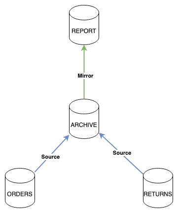
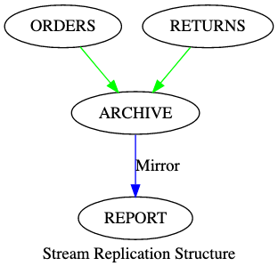
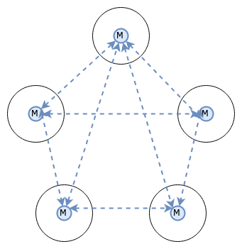
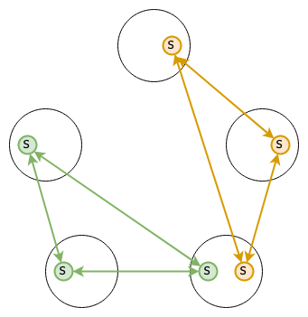
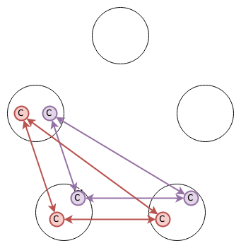

# JetStream (Technical Preview)

JetStream is the [NATS.io](https://nats.io) persistence engine that will support streaming as well as traditional message and worker queues for At-Least-Once delivery semantics.

# Contents

- [Concepts](#concepts)
  * [Streams](#streams)
  * [Consumers](#consumers)
  * [Configuration](#configuration)
- [Getting Started](#getting-started)
  * [Using Docker](#using-docker)
  * [Using Docker with NGS](#using-docker-with-ngs)
  * [Using Source](#using-source)
- [Administration and Usage from the CLI](#administration-and-usage-from-the-cli)
  * [Account Information](#account-information)
  * [Streams](#streams-1)
    + [Creating](#creating)
    + [Listing](#listing)
    + [Querying](#querying)
    + [Copying](#copying)
    + [Editing](#editing)
    + [Publishing Into a Stream](#publishing-into-a-stream)
    + [Deleting All Data](#deleting-all-data)
    + [Deleting A Message](#deleting-a-message)
    + [Deleting Sets](#deleting-sets)
  * [Consumers](#consumers-1)
    + [Creating Pull-Based Consumers](#creating-pull-based-consumers)
    + [Creating Push-Based Consumers](#creating-push-based-consumers)
    + [Listing](#listing-1)
    + [Querying](#querying-1)
    + [Consuming Pull-Based Consumers](#consuming-pull-based-consumers)
    + [Consuming Push-Based Consumers](#consuming-push-based-consumers)
- [Data Replication](#data-replication)
  * [Mirrors](#mirrors)
  * [Sources](#sources)
  * [Configuration](#configuration-1)
- [Clustering](#clustering)
  * [Design](#design)
  * [Configuration](#configuration-2)
  * [Creating clustered streams](#creating-clustered-streams)
  * [Administering the cluster](#administering-the-cluster)
    + [Account Level](#account-level)
      - [Viewing Placement and Stats](#viewing-placement-and-stats)
      - [Forcing Stream and Consumer leader election](#forcing-stream-and-consumer-leader-election)
    + [Evicting a peer](#evicting-a-peer)
    + [System Level](#system-level)
      - [Viewing the cluster state](#viewing-the-cluster-state)
    + [Forcing Meta Group leader election](#forcing-meta-group-leader-election)
    + [Evicting a peer](#evicting-a-peer-1)
  * [Docker](#docker)
- [Monitoring](#monitoring)
  * [Server Metrics](#server-metrics)
  * [Advisories](#advisories)
  * [Dashboards](#dashboards)
- [Configuration Management](#configuration-management)
  * [nats Admin CLI](#nats-admin-cli)
  * [Add a new Stream](#add-a-new-stream)
  * [Edit an existing Stream](#edit-an-existing-stream)
  * [Add a New Consumer](#add-a-new-consumer)
  * [Terraform](#terraform)
    + [Setup](#setup)
  * [GitHub Actions](#github-actions)
  * [Kubernetes JetStream Controller](#kubernetes-jetstream-controller)
- [Disaster Recovery](#disaster-recovery)
  * [Data Backup](#data-backup)
  * [Restoring Data](#restoring-data)
  * [Interactive CLI](#interactive-cli)
- [Model Deep Dive](#model-deep-dive)
  * [Stream Limits, Retention Modes and Discard Policy](#stream-limits--retention-modes-and-discard-policy)
  * [Message Deduplication](#message-deduplication)
  * [Publish Expectations and Constraints](#publish-expectations-and-constraints)
    + [Stream Name](#stream-name)
    + [Last Sequence](#last-sequence)
    + [Last Message ID](#last-message-id)
  * [Acknowledgement Models](#acknowledgement-models)
  * [Exactly Once Delivery](#exactly-once-delivery)
  * [Consumer Starting Position](#consumer-starting-position)
  * [Ephemeral Consumers](#ephemeral-consumers)
  * [Consumer Message Rates](#consumer-message-rates)
  * [Stream Templates](#stream-templates)
  * [Ack Sampling](#ack-sampling)
    + [Configuration](#configuration-3)
    + [Consuming](#consuming)
  * [Storage Overhead](#storage-overhead)
- [NATS API Reference](#nats-api-reference)
  * [Reference](#reference)
  * [Error Handling](#error-handling)
  * [Admin API](#admin-api)
    + [General Info](#general-info)
    + [Streams](#streams-2)
    + [Stream Templates](#stream-templates-1)
    + [Consumers](#consumers-2)
    + [ACLs](#acls)
  * [Acknowledging Messages](#acknowledging-messages)
  * [Fetching The Next Message From a Pull-based Consumer](#fetching-the-next-message-from-a-pull-based-consumer)
  * [Fetching From a Stream By Sequence](#fetching-from-a-stream-by-sequence)
  * [Consumer Samples](#consumer-samples)
- [Multi Tenancy and Resource Management](#multi-tenancy-and-resource-management)
- [`nats` CLI](#-nats--cli)
  * [Configuration Contexts](#configuration-contexts)
- [Next Steps](#next-steps)
  
## Concepts

In JetStream the configuration for storing messages is defined separately from how they are consumed. Storage is defined in a *Stream* and consuming messages is defined by multiple *Consumers*.

We'll discuss these 2 subjects in the context of this architecture.


While this is an incomplete architecture it does show a number of key points:

 * Many related subjects are stored in a Stream
 * Consumers can have different modes of operation and receive just subsets of the messages
 * Multiple Acknowledgement modes are supported

A new order arrives on `ORDERS.received`, gets sent to the `NEW` Consumer who, on success, will create a new message on `ORDERS.processed`.  The `ORDERS.processed` message again enters the Stream where a `DISPATCH` Consumer receives it and once processed it will create an `ORDERS.completed` message which will again enter the Stream. These operations are all `pull` based meaning they are work queues and can scale horizontally.  All require acknowledged delivery ensuring no order is missed.

All messages are delivered to a `MONITOR` Consumer without any acknowledgement and using Pub/Sub semantics - they are pushed to the monitor.

As messages are acknowledged to the `NEW` and `DISPATCH` Consumers, a percentage of them are Sampled and messages indicating redelivery counts, ack delays and more, are delivered to the monitoring system.

### Streams

Streams define how messages are stored and retention duration.  Streams consume normal NATS subjects, any message found on those subjects will be delivered to the defined storage system. You can do a normal publish to the subject for unacknowledged delivery, else if you send a Request to the subject the JetStream server will reply with an acknowledgement that it was stored.

As of January 2020, in the tech preview we have `file` and `memory` based storage systems, we do not yet support clustering.

In the diagram above we show the concept of storing all `ORDERS.*` in the Stream even though there are many types of order related messages. We'll show how you can selectively consume subsets of messages later. Relatively speaking the Stream is the most resource consuming component so being able to combine related data in this manner is important to consider.

Streams can consume many subjects. Here we have `ORDERS.*` but we could also consume `SHIPPING.state` into the same Stream should that make sense (not shown here).

Streams support various retention policies - they can be kept based on limits like max count, size or age but also more novel methods like keeping them as long as any Consumers have them unacknowledged, or work queue like behavior where a message is removed after first ack.

Streams support deduplication using a `Nats-Msg-Id` header and a sliding window within which to track duplicate messages. See the [Message Deduplication](#message-deduplication) section.

When defining Streams the items below make up the entire configuration of the set.

|Item|Description|
|----|-----------|
|MaxAge|Maximum age of any message in the stream, expressed in microseconds|
|MaxBytes|How big the Stream may be, when the combined stream size exceeds this old messages are removed|
|MaxMsgSize|The largest message that will be accepted by the Stream|
|MaxMsgs|How many messages may be in a Stream, oldest messages will be removed if the Stream exceeds this size|
|MaxConsumers|How many Consumers can be defined for a given Stream, `-1` for unlimited|
|Name|A name for the Stream that may not have spaces, tabs or `.`|
|NoAck|Disables acknowledging messages that are received by the Stream|
|Replicas|How many replicas to keep for each message in a clustered JetStream, maximum 5|
|Retention|How message retention is considered, `LimitsPolicy` (default), `InterestPolicy` or `WorkQueuePolicy`|
|Discard|When a Stream reached it's limits either, `DiscardNew` refuses new messages while `DiscardOld` (default) deletes old messages| 
|Storage|The type of storage backend, `file` and `memory` as of January 2020|
|Subjects|A list of subjects to consume, supports wildcards|
|Duplicates|The window within which to track duplicate messages|

### Consumers

Each Consumer, or related group of Consumers, of a Stream will need an Consumer defined.  It's ok to define thousands of these pointing at the same Stream.

Consumers can either be `push` based where JetStream will deliver the messages as fast as possible to a subject of your choice or `pull` based for typical work queue like behavior. The rate of message delivery in both cases is subject to `ReplayPolicy`.  A `ReplayInstant` Consumer will receive all messages as fast as possible while a `ReplayOriginal` Consumer will receive messages at the rate they were received, which is great for replaying production traffic in staging.

In the orders example above we have 3 Consumers. The first two select a subset of the messages from the Stream by specifying a specific subject like `ORDERS.processed`. The Stream consumes `ORDERS.*` and this allows you to receive just what you need. The final Consumer receives all messages in a `push` fashion.

Consumers track their progress, they know what messages were delivered, acknowledged, etc., and will redeliver messages they sent that were not acknowledged. When first created, the Consumer has to know what message to send as the first one. You can configure either a specific message in the set (`StreamSeq`), specific time (`StartTime`), all (`DeliverAll`) or last (`DeliverLast`).  This is the starting point and from there, they all behave the same - delivering all of the following messages with optional Acknowledgement.

Acknowledgements default to `AckExplicit` - the only supported mode for pull-based Consumers - meaning every message requires a distinct acknowledgement. But for push-based Consumers, you can set `AckNone` that does not require any acknowledgement, or `AckAll` which quite interestingly allows you to acknowledge a specific message, like message `100`, which will also acknowledge messages `1` through `99`. The `AckAll` mode can be a great performance boost.

Some messages may cause your applications to crash and cause a never ending loop forever poisoning your system. The `MaxDeliver` setting allow you to set a upper bound to how many times a message may be delivered.

To assist with creating monitoring applications, one can set a `SampleFrequency` which is a percentage of messages for which the system should sample and create events.  These events will include delivery counts and ack waits.

When defining Consumers the items below make up the entire configuration of the Consumer:

|Item|Description|
|----|-----------|
|AckPolicy|How messages should be acknowledged, `AckNone`, `AckAll` or `AckExplicit`|
|AckWait|How long to allow messages to remain un-acknowledged before attempting redelivery|
|DeliverPolicy|The initial starting mode of the consumer, `DeliverAll`, `DeliverLast`, `DeliverNew`, `DeliverByStartSequence` or `DeliverByStartTime`|
|DeliverySubject|The subject to deliver observed messages, when not set, a pull-based Consumer is created|
|Durable|The name of the Consumer|
|FilterSubject|When consuming from a Stream with many subjects, or wildcards, select only a specific incoming subjects, supports wildcards|
|MaxDeliver|Maximum amount times a specific message will be delivered.  Use this to avoid poison pills crashing all your services forever|
|OptStartSeq|When first consuming messages from the Stream start at this particular message in the set|
|ReplayPolicy|How messages are sent `ReplayInstant` or `ReplayOriginal`|
|SampleFrequency|What percentage of acknowledgements should be samples for observability, 0-100|
|OptStartTime|When first consuming messages from the Stream start with messages on or after this time|
|RateLimit|The rate of message delivery in bits per second|
|MaxAckPending|The maximum number of messages without acknowledgement that can be outstanding, once this limit is reached message delivery will be suspended|

### Configuration

The rest of this document introduces the `nats` utility, but for completeness and reference this is how you'd create the ORDERS scenario.  We'll configure a 1 year retention for order related messages:

```bash
$ nats str add ORDERS --subjects "ORDERS.*" --ack --max-msgs=-1 --max-bytes=-1 --max-age=1y --storage file --retention limits --max-msg-size=-1 --discard=old
$ nats con add ORDERS NEW --filter ORDERS.received --ack explicit --pull --deliver all --max-deliver=-1 --sample 100
$ nats con add ORDERS DISPATCH --filter ORDERS.processed --ack explicit --pull --deliver all --max-deliver=-1 --sample 100
$ nats con add ORDERS MONITOR --filter '' --ack none --target monitor.ORDERS --deliver last --replay instant
```

## Getting Started

This tech preview is limited to a single server and defaults to the global account. JetStream is NATS 2.0 aware and is scoped to accounts from a resource limit perspective. This is not the same as an individual server's resources, but may feel that way starting out. Don't worry, clustering is coming next but we wanted to get input early from the community.

### Using Docker

The `synadia/jsm:latest` docker image contains both the JetStream enabled NATS Server and the `nats` utility this guide covers.

In one window start JetStream:

```
$ docker run -ti -p 4222:4222 --name jetstream synadia/jsm:latest server
[1] 2020/01/20 12:44:11.752465 [INF] Starting nats-server version 2.2.0-beta
[1] 2020/01/20 12:44:11.752694 [INF] Git commit [19dc3eb]
[1] 2020/01/20 12:44:11.752875 [INF] Starting JetStream
[1] 2020/01/20 12:44:11.753692 [INF] ----------- JETSTREAM (Beta) -----------
[1] 2020/01/20 12:44:11.753794 [INF]   Max Memory:      1.46 GB
[1] 2020/01/20 12:44:11.753822 [INF]   Max Storage:     1.00 TB
[1] 2020/01/20 12:44:11.753860 [INF]   Store Directory: "/tmp/jetstream"
[1] 2020/01/20 12:44:11.753893 [INF] ----------------------------------------
[1] 2020/01/20 12:44:11.753988 [INF] JetStream state for account "$G" recovered
[1] 2020/01/20 12:44:11.754148 [INF] Listening for client connections on 0.0.0.0:4222
[1] 2020/01/20 12:44:11.754279 [INF] Server id is NDYX5IMGF2YLX6RC4WLZA7T3JGHPZR2RNCCIFUQBT6C4TP27Z6ZIC73V
[1] 2020/01/20 12:44:11.754308 [INF] Server is ready
```

And in another log into the utilities:

```
$ docker run -ti --link jetstream synadia/jsm:latest
```

This shell has the `nats` utility and all other NATS cli tools used in the rest of this guide.

Now skip to the `Administer JetStream` section.

### Using Docker with NGS

You can join a JetStream instance to your [NGS](https://synadia.com/ngs/pricing) account, first we need a credential for testing JetStream:

```
$ nsc add user -a YourAccount --name leafnode --expiry 1M
```

You'll get a credential file somewhere like `~/.nkeys/creds/synadia/YourAccount/leafnode.creds`, mount this file into the docker container for JetStream using `-v ~/.nkeys/creds/synadia/YourAccount/leafnode.creds:/leafnode.creds`.

```
$ docker run -ti -v ~/.nkeys/creds/synadia/YourAccount/leafnode.creds:/leafnode.creds --name jetstream synadia/jsm:latest server
[1] 2020/01/20 12:44:11.752465 [INF] Starting nats-server version 2.2.0-beta
...
[1] 2020/01/20 12:55:01.849033 [INF] Connected leafnode to "connect.ngs.global"
```

Your JSM shell will still connect locally, other connections in your NGS account can use JetStream at this point.

### Using Source

You will also want to have installed from the nats.go repo the examples/tools such as nats-pub, nats-sub, nats-req and possibly nats-bench. One of the design goals of JetStream was to be native to core NATS, so even though we will most certainly add in syntactic sugar to clients to make them more appealing, for this tech preview we will be using plain old NATS.

You will need a copy of the nats-server source locally and will need to be in the jetstream branch.

```
$ git clone https://github.com/nats-io/nats-server.git
$ cd nats-server
$ git checkout master
$ go build
$ ls -l nats-server
```

Starting the server you can use the `-js` flag. This will setup the server to reasonably use memory and disk. This is a sample run on my machine. JetStream will default to 1TB of disk and 75% of available memory for now.

```
$ ./nats-server -js

[16928] 2019/12/04 19:16:29.596968 [INF] Starting nats-server version 2.2.0-beta
[16928] 2019/12/04 19:16:29.597056 [INF] Git commit [not set]
[16928] 2019/12/04 19:16:29.597072 [INF] Starting JetStream
[16928] 2019/12/04 19:16:29.597444 [INF] ----------- JETSTREAM (Beta) -----------
[16928] 2019/12/04 19:16:29.597451 [INF]   Max Memory:      96.00 GB
[16928] 2019/12/04 19:16:29.597454 [INF]   Max Storage:     1.00 TB
[16928] 2019/12/04 19:16:29.597461 [INF]   Store Directory: "/var/folders/m0/k03vs55n2b54kdg7jm66g27h0000gn/T/jetstream"
[16928] 2019/12/04 19:16:29.597469 [INF] ----------------------------------------
[16928] 2019/12/04 19:16:29.597732 [INF] Listening for client connections on 0.0.0.0:4222
[16928] 2019/12/04 19:16:29.597738 [INF] Server id is NAJ5GKP5OBVISP5MW3BFAD447LMTIOAHFEWMH2XYWLL5STVGN3MJHTXQ
[16928] 2019/12/04 19:16:29.597742 [INF] Server is ready
```

You can override the storage directory if you want.

```
$ ./nats-server -js -sd /tmp/test

[16943] 2019/12/04 19:20:00.874148 [INF] Starting nats-server version 2.2.0-beta
[16943] 2019/12/04 19:20:00.874247 [INF] Git commit [not set]
[16943] 2019/12/04 19:20:00.874273 [INF] Starting JetStream
[16943] 2019/12/04 19:20:00.874605 [INF] ----------- JETSTREAM (Beta) -----------
[16943] 2019/12/04 19:20:00.874613 [INF]   Max Memory:      96.00 GB
[16943] 2019/12/04 19:20:00.874615 [INF]   Max Storage:     1.00 TB
[16943] 2019/12/04 19:20:00.874620 [INF]   Store Directory: "/tmp/test/jetstream"
[16943] 2019/12/04 19:20:00.874625 [INF] ----------------------------------------
[16943] 2019/12/04 19:20:00.874868 [INF] Listening for client connections on 0.0.0.0:4222
[16943] 2019/12/04 19:20:00.874874 [INF] Server id is NCR6KDDGWUU2FXO23WAXFY66VQE6JNWVMA24ALF2MO5GKAYFIMQULKUO
[16943] 2019/12/04 19:20:00.874877 [INF] Server is ready
```

These options can also be set in your configuration file:

```
// enables jetstream, an empty block will enable and use defaults
jetstream {
    // jetstream data will be in /data/nats-server/jetstream
    store_dir: "/data/nats-server"

    // 1GB
    max_memory_store: 1073741824

    // 10GB
    max_file_store: 10737418240
}
```

## Administration and Usage from the CLI

Once the server is running it's time to use the management tool. This can be downloaded from the [GitHub Release Page](https://github.com/nats-io/natscli/releases/) or you can use the `synadia/jsm:latest` docker image. On OS X homebrew can be used to install the latest version:

```nohighlight
$ brew tap nats-io/nats-tools
$ brew install nats-io/nats-tools/nats
$ nats --help
usage: nats [<flags>] <command> [<args> ...]
NATS Utility

Flags:
      --help                     Show context-sensitive help (also try --help-long and --help-man).
      --version                  Show application version.
  -s, --server="localhost:4222"  NATS servers
      --creds=CREDS              User credentials
      --tlscert=TLSCERT          TLS public certifcate
      --tlskey=TLSKEY            TLS private key
      --tlsca=TLSCA              TLS certifcate authority chain
      --timeout=2s               Time to give JetStream to respond to queries

Commands:
  help [<command>...]
    Show help.
 ...
```

We'll walk through the above scenario and introduce features of the CLI and of JetStream as we recreate the setup above.

Throughout this example, we'll show other commands like `nats pub` and `nats sub` to interact with the system. These are normal existing core NATS commands and JetStream is fully usable by only using core NATS.

We'll touch on some additional features but please review the section on the design model to understand all possible permutations.

### Account Information

JetStream is multi-tenant so you will need to check that your account is enabled for JetStream and is not limited. You can view your limits as follows:

```nohighlight
$ nats account info
Connection Information:

               Client ID: 8
               Client IP: 127.0.0.1
                     RTT: 178.545µs
       Headers Supported: true
         Maximum Payload: 1.0 MiB
           Connected URL: nats://localhost:4222
       Connected Address: 127.0.0.1:4222
     Connected Server ID: NCCOHA6ONXJOGAEZP4WPU4UJ3IQP2VVXEPRKTQCGBCW4IL4YYW4V4KKL

JetStream Account Information:

           Memory: 0 B of 5.7 GiB
          Storage: 0 B of 11 GiB
          Streams: 0 of Unlimited
   Max Consumers: unlimited
```

### Streams

The first step is to set up storage for our `ORDERS` related messages, these arrive on a wildcard of subjects all flowing into the same Stream and they are kept for 1 year.

#### Creating

```nohighlight
$ nats str add ORDERS
? Subjects to consume ORDERS.*
? Storage backend file
? Retention Policy Limits
? Discard Policy Old
? Message count limit -1
? Message size limit -1
? Maximum message age limit 1y
? Maximum individual message size [? for help] (-1) -1
? Number of replicas to store 3
Stream ORDERS was created

Information for Stream ORDERS

Configuration:

             Subjects: ORDERS.*
     Acknowledgements: true
            Retention: File - Limits
             Replicas: 3
     Maximum Messages: -1
        Maximum Bytes: -1
          Maximum Age: 8760h0m0s
 Maximum Message Size: -1
  Maximum Consumers: -1

Statistics:

            Messages: 0
               Bytes: 0 B
            FirstSeq: 0
             LastSeq: 0
    Active Consumers: 0
```

You can get prompted interactively for missing information as above, or do it all on one command. Pressing `?` in the CLI will help you map prompts to CLI options:

```
$ nats str add ORDERS --subjects "ORDERS.*" --ack --max-msgs=-1 --max-bytes=-1 --max-age=1y --storage file --retention limits --max-msg-size=-1 --discard old --replicas 3
```

Additionally, one can store the configuration in a JSON file, the format of this is the same as `$ nats str info ORDERS -j | jq .config`:

```
$ nats str add ORDERS --config orders.json
```

#### Listing

We can confirm our Stream was created:

```nohighlight
$ nats str ls
Streams:

	ORDERS
```

#### Querying

Information about the configuration of the Stream can be seen, and if you did not specify the Stream like below, it will prompt you based on all known ones:

```nohighlight
$ nats str info ORDERS
Information for Stream ORDERS

Configuration:

             Subjects: ORDERS.*
  No Acknowledgements: false
            Retention: File - Limits
             Replicas: 1
     Maximum Messages: -1
        Maximum Bytes: -1
          Maximum Age: 8760h0m0s
    Maximum Consumers: -1

Statistics:

            Messages: 0
               Bytes: 0 B
            FirstSeq: 0
             LastSeq: 0
    Active Consumers: 0
```

Most commands that show data as above support `-j` to show the results as JSON:

```nohighlight
$ nats str info ORDERS -j
{
  "config": {
    "name": "ORDERS",
    "subjects": [
      "ORDERS.*"
    ],
    "retention": "limits",
    "max_consumers": -1,
    "max_msgs": -1,
    "max_bytes": -1,
    "max_age": 31536000000000000,
    "storage": "file",
    "num_replicas": 1
  },
  "stats": {
    "messages": 0,
    "bytes": 0,
    "first_seq": 0,
    "last_seq": 0,
    "consumer_count": 0
  }
}
```

This is the general pattern for the entire `nats` utility as it relates to JetStream - prompting for needed information but every action can be run non-interactively making it usable as a cli api. All information output like seen above can be turned into JSON using `-j`.

In clustered mode additional information will be included:

```nohighlight
$ nats str info ORDERS
...
Cluster Information:

                 Name: JSC
               Leader: S1
              Replica: S3, current, seen 0.04s ago
              Replica: S2, current, seen 0.04s ago
```

Here the cluster name is configured as `JSC`, there is a server `S1` that's the current leader with `S3` and `S2` are replicas. Both replicas are current and have been seen recently.

#### Copying

A stream can be copied into another, which also allows the configuration of the new one to be adjusted via CLI flags:

```nohighlight
$ nats str cp ORDERS ARCHIVE --subjects "ORDERS_ARCVHIVE.*" --max-age 2y
Stream ORDERS was created

Information for Stream ARCHIVE

Configuration:

             Subjects: ORDERS_ARCVHIVE.*
...
          Maximum Age: 17520h0m0s
...
```

#### Editing

A stream configuration can be edited, which allows the configuration to be adjusted via CLI flags.  Here I have a incorrectly created ORDERS stream that I fix:

```nohighlight
$ nats str info ORDERS -j | jq .config.subjects
[
  "ORDERS.new"
]

$ nats str edit ORDERS --subjects "ORDERS.*"
Stream ORDERS was updated

Information for Stream ORDERS

Configuration:

             Subjects: ORDERS.*
....
```

Additionally one can store the configuration in a JSON file, the format of this is the same as `$ nats str info ORDERS -j | jq .config`:

```
$ nats str edit ORDERS --config orders.json
```

#### Publishing Into a Stream

Now let's add in some messages to our Stream. You can use `nats pub` to add messages, pass the `--wait` flag to see the publish ack being returned.

You can publish without waiting for acknowledgement:

```nohighlight
$ nats pub ORDERS.scratch hello
Published [sub1] : 'hello'
```

But if you want to be sure your messages got to JetStream and were persisted you can make a request:

```nohighlight
$ nats req ORDERS.scratch hello
13:45:03 Sending request on [ORDERS.scratch]
13:45:03 Received on [_INBOX.M8drJkd8O5otORAo0sMNkg.scHnSafY]: '+OK'
```

Keep checking the status of the Stream while doing this and you'll see it's stored messages increase.

```nohighlight
$ nats str info ORDERS
Information for Stream ORDERS
...
Statistics:

            Messages: 3
               Bytes: 147 B
            FirstSeq: 1
             LastSeq: 3
    Active Consumers: 0
```

After putting some throw away data into the Stream, we can purge all the data out - while keeping the Stream active:

#### Deleting All Data

To delete all data in a stream use `purge`:

```nohighlight
$ nats str purge ORDERS -f
...
Statistics:

            Messages: 0
               Bytes: 0 B
            FirstSeq: 1,000,001
             LastSeq: 1,000,000
    Active Consumers: 0
```

#### Deleting A Message

A single message can be securely removed from the stream:

```nohighlight
$ nats str rmm ORDERS 1 -f
```

#### Deleting Sets

Finally for demonstration purposes, you can also delete the whole Stream and recreate it so then we're ready for creating the Consumers:

```
$ nats str rm ORDERS -f
$ nats str add ORDERS --subjects "ORDERS.*" --ack --max-msgs=-1 --max-bytes=-1 --max-age=1y --storage file --retention limits --max-msg-size=-1
```

### Consumers

Consumers is how messages are read or consumed from the Stream. We support pull and push-based Consumers and the example scenario has both, lets walk through that.

#### Creating Pull-Based Consumers

The `NEW` and `DISPATCH` Consumers are pull-based, meaning the services consuming data from them have to ask the system for the next available message.  This means you can easily scale your services up by adding more workers and the messages will get spread across the workers based on their availability.

Pull-based Consumers are created the same as push-based Consumers, just don't specify a delivery target.

```
$ nats con ls ORDERS
No Consumers defined
```

We have no Consumers, lets add the `NEW` one:

I supply the `--sample` options on the CLI as this is not prompted for at present, everything else is prompted. The help in the CLI explains each:

```
$ nats con add --sample 100
? Select a Stream ORDERS
? Consumer name NEW
? Delivery target
? Start policy (all, last, 1h, msg sequence) all
? Filter Stream by subject (blank for all) ORDERS.received
? Maximum Allowed Deliveries 20
Information for Consumer ORDERS > NEW

Configuration:

        Durable Name: NEW
           Pull Mode: true
             Subject: ORDERS.received
         Deliver All: true
        Deliver Last: false
          Ack Policy: explicit
            Ack Wait: 30s
       Replay Policy: instant
  Maximum Deliveries: 20
       Sampling Rate: 100

State:

  Last Delivered Message: Consumer sequence: 1 Stream sequence: 1
    Acknowledgment floor: Consumer sequence: 0 Stream sequence: 0
        Pending Messages: 0
    Redelivered Messages: 0
```

This is a pull-based Consumer (empty Delivery Target), it gets messages from the first available message and requires specific acknowledgement of each and every message.

It only received messages that originally entered the Stream on `ORDERS.received`. Remember the Stream subscribes to `ORDERS.*`, this lets us select a subset of messages from the Stream.
 
A Maximum Delivery limit of 20 is set, this means if the message is not acknowledged it will be retried but only up to this maximum total deliveries.

Again this can all be done in a single CLI call, lets make the `DISPATCH` Consumer:

```
$ nats con add ORDERS DISPATCH --filter ORDERS.processed --ack explicit --pull --deliver all --sample 100 --max-deliver 20
```

Additionally, one can store the configuration in a JSON file, the format of this is the same as `$ nats con info ORDERS DISPATCH -j | jq .config`:

```
$ nats con add ORDERS MONITOR --config monitor.json
```

#### Creating Push-Based Consumers

Our `MONITOR` Consumer is push-based, has no ack and will only get new messages and is not sampled:

```
$ nats con add
? Select a Stream ORDERS
? Consumer name MONITOR
? Delivery target monitor.ORDERS
? Start policy (all, last, 1h, msg sequence) last
? Acknowledgement policy none
? Replay policy instant
? Filter Stream by subject (blank for all)
? Maximum Allowed Deliveries -1
Information for Consumer ORDERS > MONITOR

Configuration:

      Durable Name: MONITOR
  Delivery Subject: monitor.ORDERS
       Deliver All: false
      Deliver Last: true
        Ack Policy: none
     Replay Policy: instant

State:

  Last Delivered Message: Consumer sequence: 1 Stream sequence: 3
    Acknowledgment floor: Consumer sequence: 0 Stream sequence: 2
        Pending Messages: 0
    Redelivered Messages: 0
```

Again you can do this with a single non interactive command:

```
$ nats con add ORDERS MONITOR --ack none --target monitor.ORDERS --deliver last --replay instant --filter ''
```

Additionally one can store the configuration in a JSON file, the format of this is the same as `$ nats con info ORDERS MONITOR -j | jq .config`:

```
$ nats con add ORDERS --config monitor.json
```

#### Listing

You can get a quick list of all the Consumers for a specific Stream:

```
$ nats con ls ORDERS
Consumers for Stream ORDERS:

        DISPATCH
        MONITOR
        NEW
```

#### Querying

All details for an Consumer can be queried, lets first look at a pull-based Consumer:

```
$ nats con info ORDERS DISPATCH
Information for Consumer ORDERS > DISPATCH

Configuration:

      Durable Name: DISPATCH
         Pull Mode: true
           Subject: ORDERS.processed
       Deliver All: true
      Deliver Last: false
        Ack Policy: explicit
          Ack Wait: 30s
     Replay Policy: instant
     Sampling Rate: 100

State:

  Last Delivered Message: Consumer sequence: 1 Stream sequence: 1
    Acknowledgment floor: Consumer sequence: 0 Stream sequence: 0
        Pending Messages: 0
    Redelivered Messages: 0
```

More details about the `State` section will be shown later when discussing the ack models in depth.

#### Consuming Pull-Based Consumers

Pull-based Consumers require you to specifically ask for messages and ack them, typically you would do this with the client library `Request()` feature, but the `jsm` utility has a helper:

First we ensure we have a message:

```
$ nats pub ORDERS.processed "order 1"
$ nats pub ORDERS.processed "order 2"
$ nats pub ORDERS.processed "order 3"
```

We can now read them using `nats`:

```
$ nats con next ORDERS DISPATCH
--- received on ORDERS.processed
order 1

Acknowledged message

$ nats con next ORDERS DISPATCH
--- received on ORDERS.processed
order 2

Acknowledged message
```

You can prevent ACKs by supplying `--no-ack`.

To do this from code you'd send a `Request()` to `$JS.API.CONSUMER.MSG.NEXT.ORDERS.DISPATCH`:

```
$ nats req '$JS.API.CONSUMER.MSG.NEXT.ORDERS.DISPATCH' ''
Published [$JS.API.CONSUMER.MSG.NEXT.ORDERS.DISPATCH] : ''
Received [ORDERS.processed] : 'order 3'
```

Here `nats req` cannot ack, but in your code you'd respond to the received message with a nil payload as an Ack to JetStream.

#### Consuming Push-Based Consumers

Push-based Consumers will publish messages to a subject and anyone who subscribes to the subject will get them, they support different Acknowledgement models covered later, but here on the `MONITOR` Consumer we have no Acknowledgement.

```
$ nats con info ORDERS MONITOR
...
  Delivery Subject: monitor.ORDERS
...
```

The Consumer is publishing to that subject, so lets listen there:

```
$ nats sub monitor.ORDERS
Listening on [monitor.ORDERS]
[#3] Received on [ORDERS.processed]: 'order 3'
[#4] Received on [ORDERS.processed]: 'order 4'
```

Note the subject here of the received message is reported as `ORDERS.processed` this helps you distinguish what you're seeing in a Stream covering a wildcard, or multiple subject, subject space.

This Consumer needs no ack, so any new message into the ORDERS system will show up here in real time.

## Data Replication

**WARNING: Replication is an Alpha level feature**

Replication allow you to move data between streams in either a 1:1 mirror style or by multiplexing multiple source streams into a new stream.  In future builds this will allow data to be replicated between accounts as well, ideal for sending data from a Leafnode into a central store.



Here we have 2 main streams - _ORDERS_ and _RETURNS_ - these streams are clustered across 3 nodes. These Streams have short retention periods and are memory based.

We create a _ARCHIVE_ stream that has 2 _sources_ set, the _ARCHIVE_ will pull data from the sources into itself.  This stream has a very long retention period and is file based and replicated across 3 nodes.  Additional messages can be added to the ARCHIVE by sending to it directly.

Finally, we create a _REPORT_ stream mirrored from _ARCHIVE_ that is not clustered and retains data for a month.  The _REPORT_ Stream does not listen for any incoming messages, it can only consume data from _ARCHIVE_.

### Mirrors

A *mirror* copies data from 1 other stream, as far as possible IDs and ordering will match exactly the source. A *mirror* does not listen on a subject for any data to be added. The Start Sequence and Start Time can be set, but no subject filter. A stream can only have 1 *mirror* and if it is a mirror it cannot also have any *source*.

### Sources

A *source* is a stream where data is copied from, one stream can have multiple sources and will read data in from them all. The stream will also listen for messages on it's own subject. We can therefore not maintain absolute ordering, but data from 1 single source will be in the correct order but mixed in with other streams. You might also find the timestamps of streams can be older and newer mixed in together as a result.

A Stream with sources may also listen on subjects, but could have no listening subject.  When using the `nats` CLI to create sourced streams use `--subjects` to supply subjects to listen on.

A source can have start time or start sequence and can filter by a subject. 

### Configuration

The ORDERS and RETURNS streams as normal, I will not show how to create them.

```nohighlight
$ nats s report
Obtaining Stream stats

+---------+---------+----------+-----------+----------+-------+------+---------+----------------------+
| Stream  | Storage | Template | Consumers | Messages | Bytes | Lost | Deleted | Cluster              |
+---------+---------+----------+-----------+----------+-------+------+---------+----------------------+
| ORDERS  | Memory  |          | 0         | 0        | 0 B   | 0    | 0       | n1-c2, n2-c2*, n3-c2 |
| RETURNS | Memory  |          | 0         | 0        | 0 B   | 0    | 0       | n1-c2*, n2-c2, n3-c2 |
+---------+---------+----------+-----------+----------+-------+------+---------+----------------------+
```

We now add the ARCHIVE:

```nohighlight
$ nats s add ARCHIVE --source ORDERS --source RETURNS
? Storage backend file
? Retention Policy Limits
? Discard Policy Old
? Message count limit -1
? Message size limit -1
? Maximum message age limit -1
? Maximum individual message size -1
? Duplicate tracking time window 2m
? Number of replicas to store 3
? ORDERS Source Start Sequence 0
? ORDERS Source UTC Time Stamp (YYYY:MM:DD HH:MM:SS)
? ORDERS Source Filter source by subject
? RETURNS Source Start Sequence 0
? RETURNS Source UTC Time Stamp (YYYY:MM:DD HH:MM:SS)
? RETURNS Source Filter source by subject
```

And we add the REPORT:

```nohighlight
$ nats s add REPORT --mirror ARCHIVE
? Storage backend file
? Retention Policy Limits
? Discard Policy Old
? Message count limit -1
? Message size limit -1
? Maximum message age limit 1M
? Maximum individual message size -1
? Duplicate tracking time window 2m
? Number of replicas to store 1
? Mirror Start Sequence 0
? Mirror Start Time (YYYY:MM:DD HH:MM:SS)
? Mirror subject filter
```

When configured we'll see some additional information in a `nats stream info` output:

```nohighlight
$ nats stream info ARCHIVE
...
Source Information:

          Stream Name: ORDERS
                  Lag: 0
            Last Seen: 2m23s

          Stream Name: RETURNS
                  Lag: 0
            Last Seen: 2m15s
...

$ nats stream info REPORT
...
Mirror Information:

          Stream Name: ARCHIVE
                  Lag: 0
            Last Seen: 2m35s
...
```

Here the `Lag` is how far behind we were reported as being last time we saw a message.

We can confirm all our setup using a `nats stream report`:

```nohighlight
$ nats s report
+-------------------------------------------------------------------------------------------------------------------+
|                                                   Stream Report                                                   |
+---------+---------+----------+-------------+-----------+----------+-------+------+---------+----------------------+
| Stream  | Storage | Template | Replication | Consumers | Messages | Bytes | Lost | Deleted | Cluster              |
+---------+---------+----------+-------------+-----------+----------+-------+------+---------+----------------------+
| ARCHIVE | File    |          | Sourced     | 1         | 0        | 0 B   | 0    | 0       | n1-c2*, n2-c2, n3-c2 |
| ORDERS  | Memory  |          |             | 1         | 0        | 0 B   | 0    | 0       | n1-c2, n2-c2*, n3-c2 |
| REPORT  | File    |          | Mirror      | 0         | 0        | 0 B   | 0    | 0       | n1-c2*               |
| RETURNS | Memory  |          |             | 1         | 0        | 0 B   | 0    | 0       | n1-c2, n2-c2, n3-c2* |
+---------+---------+----------+-------------+-----------+----------+-------+------+---------+----------------------+

+---------------------------------------------------------+
|                   Replication Report                    |
+---------+--------+---------------+--------+-----+-------+
| Stream  | Kind   | Source Stream | Active | Lag | Error |
+---------+--------+---------------+--------+-----+-------+
| ARCHIVE | Source | ORDERS        | never  | 0   |       |
| ARCHIVE | Source | RETURNS       | never  | 0   |       |
| REPORT  | Mirror | ARCHIVE       | never  | 0   |       |
+---------+--------+---------------+--------+-----+-------+
```

We then create some data in both ORDERS and RETURNS:

```nohighlight
$ nats req ORDERS.new "ORDER {{Count}}" --count 100
$ nats req RETURNS.new "RETURN {{Count}}" --count 100
```

We can now see from a Stream Report that the data has been replicated:

```nohighlight
$ nats s report --dot replication.dot
Obtaining Stream stats

+---------+---------+----------+-----------+----------+---------+------+---------+----------------------+
| Stream  | Storage | Template | Consumers | Messages | Bytes   | Lost | Deleted | Cluster              |
+---------+---------+----------+-----------+----------+---------+------+---------+----------------------+
| ORDERS  | Memory  |          | 1         | 100      | 3.3 KiB | 0    | 0       | n1-c2, n2-c2*, n3-c2 |
| RETURNS | Memory  |          | 1         | 100      | 3.5 KiB | 0    | 0       | n1-c2*, n2-c2, n3-c2 |
| ARCHIVE | File    |          | 1         | 200      | 27 KiB  | 0    | 0       | n1-c2, n2-c2, n3-c2* |
| REPORT  | File    |          | 0         | 200      | 27 KiB  | 0    | 0       | n1-c2*               |
+---------+---------+----------+-----------+----------+---------+------+---------+----------------------+

+---------------------------------------------------------+
|                   Replication Report                    |
+---------+--------+---------------+--------+-----+-------+
| Stream  | Kind   | Source Stream | Active | Lag | Error |
+---------+--------+---------------+--------+-----+-------+
| ARCHIVE | Source | ORDERS        | 14.48s | 0   |       |
| ARCHIVE | Source | RETURNS       | 9.83s  | 0   |       |
| REPORT  | Mirror | ARCHIVE       | 9.82s  | 0   |       |
+---------+--------+---------------+--------+-----+-------+
```

Here we also pass the `--dot replication.dot` argument that writes a GraphViz format map of the replication setup.



## Clustering

Clustering allow JetStream to span multiple servers and clusters, providing a highly available data storage service in a share-nothing manner.

Once a JetStream cluster is operating interactions with the CLI and with `nats` CLI is the same as before.

### Design

JetStream clustering use the RAFT protocol to synchronize state and data within a cluster, JetStream manages 3 sets of RAFT groups:

**Meta Group** - all servers join the Meta Group and the JetStream API is managed by this group. A leader is elected and this owns the API and takes care of server placement.



**Stream Group** - each Stream creates a RAFT group, this group synchronizes state and data between its members. The elected leader handles ACKs and so forth, if there is no leader the stream will not accept messages.



**Consumer Group** - each Consumer creates a RAFT group, this group synchronizes consumer state between its members. The group will live on the machines where the Stream Group is and handle consumption ACKs etc.  Each Consumer will have its own group.



### Configuration

There is very little extra work to do for clustered JetStream, the main thing is that you need to set a specific cluster name and server name.

A sample configuration file for one server in a cluster is included here:

```nohighlight
server_name: S1
port: 4222

jetstream: true

cluster {
  name: JSC
  listen: 0.0.0.0:4245

  routes: [
    nats://nats1.example.net:4245
    nats://nats2.example.net:4245
    nats://nats3.example.net:4245
  ]
}
```

### Creating clustered streams

When adding a stream using the `nats` CLI the number of replicas will be asked, when you choose a number more than 1, (we suggest 1, 3 or 5), the data will be stored o multiple nodes in your cluster using the RAFT protocol as above.

```nohighlight
$ nats str add ORDERS --replicas 3
....
Information for Stream ORDERS_4 created 2021-02-05T12:07:34+01:00
....
Configuration:
....
             Replicas: 3
             
Cluster Information:

                 Name: C1
               Leader: n1-c1
              Replica: n4-c1, current, seen 0.07s ago
              Replica: n3-c1, current, seen 0.07s ago

```

Above you can see that the cluster information will be reported in all cases where Stream info is shown such as after add or using `nats stream info`.

Here we have a stream in the NATS cluster `C1`, its current leader is a node `n1-c1` and it has 2 followers - `n4-c1` and `n3-c1`.

The `current` indicates that followers are up to date and have all the messages, here both cluster peers were seen very recently.

The replica count cannot be edited once configured.

### Administering the cluster

#### Account Level

Within an account there are operations and reports that show where users data is placed and which allow them some basic interactions with the RAFT system.

##### Viewing Placement and Stats

Users can get overall statistics about their streams and also where these streams are placed:

```
$ nats stream report
Obtaining Stream stats

+----------+-----------+----------+--------+---------+------+---------+----------------------+----------+
| Stream   | Consumers | Messages | Bytes  | Storage | Lost | Deleted | Cluster              | Template |
+----------+-----------+----------+--------+---------+------+---------+----------------------+----------+
| ORDERS   | 4         | 0        | 0 B    | File    | 0    | 0       | n1-c1*, n2-c1, n3-c1 |          |
| ORDERS_3 | 4         | 0        | 0 B    | File    | 0    | 0       | n1-c1*, n2-c1, n3-c1 |          |
| ORDERS_4 | 4         | 0        | 0 B    | File    | 0    | 0       | n1-c1*, n2-c1, n3-c1 |          |
| ORDERS_5 | 4         | 0        | 0 B    | File    | 0    | 0       | n1-c1, n2-c1, n3-c1* |          |
| ORDERS_2 | 4         | 1,385    | 13 MiB | File    | 0    | 1       | n1-c1, n2-c1, n3-c1* |          |
| ORDERS_0 | 4         | 1,561    | 14 MiB | File    | 0    | 0       | n1-c1, n2-c1*, n3-c1 |          |
+----------+-----------+----------+--------+---------+------+---------+----------------------+----------+
```

Similarly, Consumers can be reported on:

```
$ nats c report ORDERS
Consumer report for ORDERS with 4 consumers

+----------+------+------------+----------+-------------+-------------+--------------+-----------+----------------------+
| Consumer | Mode | Ack Policy | Ack Wait | Ack Pending | Redelivered | Unprocessed  | Ack Floor | Cluster              |
+----------+------+------------+----------+-------------+-------------+--------------+-----------+----------------------+
| C0       | Pull | Explicit   | 30.00s   | 0           | 0           | 56,004 / 53% | 9         | n2-c1*, n1-c1, n3-c1 |
| C1       | Pull | Explicit   | 30.00s   | 0           | 0           | 55,779 / 53% | 0         | n1-c1*, n2-c1, n3-c1 |
| C2       | Pull | Explicit   | 30.00s   | 0           | 0           | 55,692 / 53% | 0         | n1-c1*, n2-c1, n3-c1 |
| C3       | Pull | Explicit   | 30.00s   | 0           | 0           | 56,249 / 53% | 0         | n2-c1*, n1-c1, n3-c1 |
+----------+------+------------+----------+-------------+-------------+--------------+-----------+----------------------+
```

##### Forcing Stream and Consumer leader election

Every RAFT group has a leader that's elected by the group when needed. Generally there is no reason to interfere with this process, but you might want to trigger a leader change at a convenient time.  Leader elections will represent short interruptions to the stream so if you know you will work on a node later it might be worth moving leadership away from it ahead of time.

Moving leadership away from a node does not remove it from the cluster and does not prevent it from becoming a leader again, this is merely a triggered leader election.

```nohighlight
$ nats stream cluster step-down ORDERS
14:32:17 Requesting leader step down of "n1-c1" in a 3 peer RAFT group
14:32:18 New leader elected "n4-c1"

Information for Stream ORDERS created 2021-02-05T12:07:34+01:00
...
Cluster Information:

                 Name: c1
               Leader: n4-c1
              Replica: n1-c1, current, seen 0.12s ago
              Replica: n3-c1, current, seen 0.12s ago
```

The same is true for consumers, `nats consumer cluster step-down ORDERS NEW`.

#### Evicting a peer

Generally when shutting down NATS, including using Lame Duck Mode, the cluster will notice this and continue to function. A 5 node cluster can withstand 2 nodes being down.

There might be a case though where you know a machine will never return, and you want to signal to JetStream that the machine will not return.  This will remove it from the Stream in question and all it's Consumers.

After the node is removed the cluster will notice that the replica count is not honored anymore and will immediately pick a new node and start replicating data to it.  The new node will be selected using the same placement rules as the existing stream.

```nohighlight
$ nats s cluster peer-remove ORDERS
? Select a Peer n4-c1
14:38:50 Removing peer "n4-c1"
14:38:50 Requested removal of peer "n4-c1"
```

At this point the stream and all consumers will have removed `n4-c1` from the group, they will all start new peer selection and data replication.

```nohighlight
$ nats stream info ORDERS
....
Cluster Information:

                 Name: c1
               Leader: n3-c1
              Replica: n1-c1, current, seen 0.02s ago
              Replica: n2-c1, outdated, seen 0.42s ago
```

We can see a new replica was picked, the stream is back to replication level of 3 and `n4-c1` is not active any more in this Stream or any of its Consumers.

#### System Level

Systems users can view state of the Meta Group - but not individual Stream or Consumers.

##### Viewing the cluster state

We have a high level report of cluster state:

```nohighlight
$ nats server report jetstream --user system
+--------------------------------------------------------------------------------------------------+
|                                        JetStream Summary                                         |
+--------+---------+---------+-----------+----------+--------+--------+--------+---------+---------+
| Server | Cluster | Streams | Consumers | Messages | Bytes  | Memory | File   | API Req | API Err |
+--------+---------+---------+-----------+----------+--------+--------+--------+---------+---------+
| n3-c2  | c2      | 0       | 0         | 0        | 0 B    | 0 B    | 0 B    | 1       | 0       |
| n3-c1  | c1      | 6       | 24        | 2,946    | 27 MiB | 0 B    | 27 MiB | 3       | 0       |
| n2-c2  | c2      | 0       | 0         | 0        | 0 B    | 0 B    | 0 B    | 3       | 0       |
| n1-c2  | c2      | 0       | 0         | 0        | 0 B    | 0 B    | 0 B    | 14      | 2       |
| n2-c1  | c1      | 6       | 24        | 2,946    | 27 MiB | 0 B    | 27 MiB | 15      | 0       |
| n1-c1* | c1      | 6       | 24        | 2,946    | 27 MiB | 0 B    | 27 MiB | 31      | 0       |
+--------+---------+---------+-----------+----------+--------+--------+--------+---------+---------+
|        |         | 18      | 72        | 8,838    | 80 MiB | 0 B    | 80 MiB | 67      | 2       |
+--------+---------+---------+-----------+----------+--------+--------+--------+---------+---------+

+---------------------------------------------------+
|            RAFT Meta Group Information            |
+-------+--------+---------+---------+--------+-----+
| Name  | Leader | Current | Offline | Active | Lag |
+-------+--------+---------+---------+--------+-----+
| n1-c1 | yes    | true    | false   | 0.00s  | 0   |
| n1-c2 |        | true    | false   | 0.05s  | 0   |
| n2-c1 |        | true    | false   | 0.05s  | 0   |
| n2-c2 |        | true    | false   | 0.05s  | 0   |
| n3-c1 |        | true    | false   | 0.05s  | 0   |
| n3-c2 |        | true    | false   | 0.05s  | 0   |
+-------+--------+---------+---------+--------+-----+
```

This is a full cluster wide report, the report can be limited to a specific account using `--account`.

Here we see the distribution of streams, messages, api calls etc by across 2 super clusters and an overview of the RAFT meta group.

In the Meta Group report the server `n2-c1` is not current and has not been seen for 9 seconds, it's also behind by 2 raft operations.

This report is built using raw data that can be obtained from the monitor port on the `/jsz` url, or over nats using:

```nohightlight
$ nats server req jetstream --help
...
      --name=NAME               Limit to servers matching a server name
      --host=HOST               Limit to servers matching a server host name
      --cluster=CLUSTER         Limit to servers matching a cluster name
      --tags=TAGS ...           Limit to servers with these configured tags
      --account=ACCOUNT         Show statistics scoped to a specific account
      --accounts                Include details about accounts
      --streams                 Include details about Streams
      --consumer                Include details about Consumers
      --config                  Include details about configuration
      --leader                  Request a response from the Meta-group leader only
      --all                     Include accounts, streams, consumers and configuration
$ nats server req jetstream --leader
```

This will produce a wealth of raw information about the current state of your cluster - here requesting it from the leader only.

#### Forcing Meta Group leader election

Similar to Streams and Consumers above the Meta Group allows leader stand down. The Meta Group is cluster wide and spans all accounts, therefore to manage the meta group you have to use a `SYSTEM` user.

```nohighlight
$ nats server raft step-down --user system
17:44:24 Current leader: n2-c2
17:44:24 New leader: n1-c2
```

#### Evicting a peer

TBD

### Docker

Included in this repository is a `docker-compose.yaml` file that starts a 3 node cluster, it will persist data in `./jetstream-cluster/<server name>` and the 3 servers listens for client connections on ports `4222`, `4223` and `4224`

## Monitoring

### Server Metrics

Typically, NATS is monitored via HTTP endpoints like `/varz`, we do not at this moment have a JetStream equivelant, but it's planned that server and account level metrics will be made available.

### Advisories

JetStream publish a number of advisories that can inform operations about health and state of the Streams.  These advisories are published to normal NATS subjects below `$JS.EVENT.ADVISORY.>` and one can store these advisories in JetStream Streams if desired.

The command `nats event --js-advisory` can view all these events on your console. The Golang package [jsm.go](https://github.com/nats-io/jsm.go) can consume and render these events and have data types for each of these events.

All these events have JSON Schemas that describe them, schemas can be viewed on the CLI using the `nats schema show <schema kind>` command.

|Description|Subject|Kind|
|-----------|-------|----|
|API interactions|`$JS.EVENT.ADVISORY.API`|`io.nats.jetstream.advisory.v1.api_audit`|
|Stream CRUD operations|`$JS.EVENT.ADVISORY.STREAM.CREATED.<STREAM>`|`io.nats.jetstream.advisory.v1.stream_action`|
|Consumer CRUD operations|`$JS.EVENT.ADVISORY.CONSUMER.CREATED.<STREAM>.<CONSUMER>`|`io.nats.jetstream.advisory.v1.consumer_action`|
|Snapshot started using `nats stream backup`|`$JS.EVENT.ADVISORY.STREAM.SNAPSHOT_CREATE.<STREAM>`|`io.nats.jetstream.advisory.v1.snapshot_create`|
|Snapshot completed|`$JS.EVENT.ADVISORY.STREAM.SNAPSHOT_COMPLETE.<STREAM>`|`io.nats.jetstream.advisory.v1.snapshot_complete`|
|Restore started using `nats stream restore`|`$JS.EVENT.ADVISORY.STREAM.RESTORE_CREATE.<STREAM>`|`io.nats.jetstream.advisory.v1.restore_create`|
|Restore completed|`$JS.EVENT.ADVISORY.STREAM.RESTORE_COMPLETE.<STREAM>`|`io.nats.jetstream.advisory.v1.restore_complete`|
|Consumer maximum delivery reached|`$JS.EVENT.ADVISORY.CONSUMER.MAX_DELIVERIES.<STREAM>.<CONSUMER>`|`io.nats.jetstream.advisory.v1.max_deliver`|
|Message delivery terminated using AckTerm|`$JS.EVENT.ADVISORY.CONSUMER.MSG_TERMINATED.<STREAM>.<CONSUMER>`|`io.nats.jetstream.advisory.v1.terminated`|
|Message acknowledged in a sampled Consumer|`$JS.EVENT.METRIC.CONSUMER.ACK.<STREAM>.<CONSUMER>`|`io.nats.jetstream.metric.v1.consumer_ack`|
|Clustered Stream elected a new leader|`$JS.EVENT.ADVISORY.STREAM.LEADER_ELECTED.<STREAM>`|`io.nats.jetstream.advisory.v1.stream_leader_elected`|
|Clustered Stream lost quorum|`$JS.EVENT.ADVISORY.STREAM.QUORUM_LOST.<STREAM>`|`io.nats.jetstream.advisory.v1.stream_quorum_lost`
|Clustered Consumer elected a new leader|`$JS.EVENT.ADVISORY.CONSUMER.LEADER_ELECTED.<STREAM>.<CONSUMER>`|`io.nats.jetstream.advisory.v1.consumer_leader_elected`|
|Clustered Consumer lost quorum|`$JS.EVENT.ADVISORY.CONSUMER.QUORUM_LOST.<STREAM>.<CONSUMER>`|`io.nats.jetstream.advisory.v1.consumer_quorum_lost`|

### Dashboards

The [NATS Surveyor](https://github.com/nats-io/nats-surveyor) system has initial support for passing JetStream metrics to Prometheus, dashboards and more will be added towards final release.

## Configuration Management

In many cases managing the configuration in your application code is the best model, many teams though wish to pre-create Streams and Consumers. 

We support a number of tools to assist with this:

 * `nats` CLI with configuration files 
 * [Terraform](https://www.terraform.io/)
 * [GitHub Actions](https://github.com/features/actions)
 * [Kubernetes JetStream Controller](https://github.com/nats-io/nack#jetstream-controller) 

### nats Admin CLI

The `nats` CLI can be used to manage Streams and Consumers easily using it's `--config` flag, for example:

### Add a new Stream

This creates a new Stream based on `orders.json`. The `orders.json` file can be extracted from an existing stream using `nats stream info ORDERS -j | jq .config`

```
$ nats str add ORDERS --config orders.json
```

### Edit an existing Stream

This edits an existing stream ensuring it complies with the configuration in `orders.json`
```
$ nats str edit ORDERS --config orders.json
```

### Add a New Consumer

This creates a new Consumer based on `orders_new.json`. The `orders_new.json` file can be extracted from an existing stream using `nats con info ORDERS NEW -j | jq .config`

```
$ nats con add ORDERS NEW --config orders_new.json
```

### Terraform

Terraform is a Cloud configuration tool from Hashicorp found at [terraform.io](https://www.terraform.io/), we maintain a Provider for Terraform called [terraform-provider-jetstream](https://github.com/nats-io/terraform-provider-jetstream/) that can maintain JetStream using Terraform.

#### Setup

Our provider is not hosted by Hashicorp so installation is a bit more complex than typical. Browse to the [Release Page](https://github.com/nats-io/terraform-provider-jetstream/releases) and download the release for your platform and extract it into your Terraform plugins directory.

```
$ unzip -l terraform-provider-jetstream_0.0.2_darwin_amd64.zip
Archive:  terraform-provider-jetstream_0.0.2_darwin_amd64.zip
  Length      Date    Time    Name
---------  ---------- -----   ----
    11357  03-09-2020 10:48   LICENSE
     1830  03-09-2020 12:53   README.md
 24574336  03-09-2020 12:54   terraform-provider-jetstream_v0.0.2
```

Place the `terraform-provider-jetstream_v0.0.2` file in `~/.terraform.d/plugins/terraform-provider-jetstream_v0.0.2`

In your project you can configure the Provider like this:

```terraform
provider "jetstream" {
  servers = "connect.ngs.global"
  credentials = "ngs_jetstream_admin.creds"
}
```

And start using it, here's an example that create the `ORDERS` example. Review the [Project README](https://github.com/nats-io/terraform-provider-jetstream#readme) for full details.

```terraform
resource "jetstream_stream" "ORDERS" {
  name     = "ORDERS"
  subjects = ["ORDERS.*"]
  storage  = "file"
  max_age  = 60 * 60 * 24 * 365
}

resource "jetstream_consumer" "ORDERS_NEW" {
  stream_id      = jetstream_stream.ORDERS.id
  durable_name   = "NEW"
  deliver_all    = true
  filter_subject = "ORDERS.received"
  sample_freq    = 100
}

resource "jetstream_consumer" "ORDERS_DISPATCH" {
  stream_id      = jetstream_stream.ORDERS.id
  durable_name   = "DISPATCH"
  deliver_all    = true
  filter_subject = "ORDERS.processed"
  sample_freq    = 100
}

resource "jetstream_consumer" "ORDERS_MONITOR" {
  stream_id        = jetstream_stream.ORDERS.id
  durable_name     = "MONITOR"
  deliver_last     = true
  ack_policy       = "none"
  delivery_subject = "monitor.ORDERS"
}

output "ORDERS_SUBJECTS" {
  value = jetstream_stream.ORDERS.subjects
}
```

### GitHub Actions

We have a pack of GitHub Actions that let you manage an already running JetStream Server, useful for managing releases or standing up test infrastructure.

Full details and examples are in the [jetstream-gh-actions](https://github.com/nats-io/jetstream-gh-action) repository, here's an example.

```yaml
on: push
name: orders
jobs:

  # First we delete the ORDERS stream and consumer if they already exist
  clean_orders:
    runs-on: ubuntu-latest
    steps:
      - name: orders_stream
        uses: nats-io/jetstream-gh-action/delete/stream@master
        with:
          missing_ok: 1
          stream: ORDERS
          server: js.example.net

  # Now we create the Stream and Consumers using the same configuration files the 
  # nats CLI utility would use as shown above
  create_orders:
    runs-on: ubuntu-latest
    needs: clean_orders
    steps:
      - uses: actions/checkout@master
      - name: orders_stream
        uses: nats-io/jetstream-gh-action/create/stream@master
        with:
          config: ORDERS.json
          server: js.example.net
      - name: orders_new_consumer
        uses: nats-io/jetstream-gh-action/create/consumer@master
        with:
          config: ORDERS_NEW.json
          stream: ORDERS
          server: js.example.net

  # We publish a message to a specific Subject, perhaps some consumer is 
  # waiting there for it to kick off tests
  publish_message:
    runs-on: ubuntu-latest
    needs: create_orders
    steps:
      - uses: actions/checkout@master
      - name: orders_new_consumer
        uses: nats-io/jetstream-gh-action@master
        with:
          subject: ORDERS.deployment
          message: Published new deployment via "${{ github.event_name }}" in "${{ github.repository }}"
          server: js.example.net
```

### Kubernetes JetStream Controller

The JetStream controllers allows you to manage NATS JetStream Streams and Consumers via K8S CRDs. You can find more info on how to deploy and usage [here](https://github.com/nats-io/nack#getting-started).  Below you can find an example on how to create a stream and a couple of consumers:

```yaml
---
apiVersion: jetstream.nats.io/v1beta1
kind: Stream
metadata:
  name: mystream
spec:
  name: mystream
  subjects: ["orders.*"]
  storage: memory
  maxAge: 1h
---
apiVersion: jetstream.nats.io/v1beta1
kind: Consumer
metadata:
  name: my-push-consumer
spec:
  streamName: mystream
  durableName: my-push-consumer
  deliverSubject: my-push-consumer.orders
  deliverPolicy: last
  ackPolicy: none
  replayPolicy: instant
---
apiVersion: jetstream.nats.io/v1beta1
kind: Consumer
metadata:
  name: my-pull-consumer
spec:
  streamName: mystream
  durableName: my-pull-consumer
  deliverPolicy: all
  filterSubject: orders.received
  maxDeliver: 20
  ackPolicy: explicit
```

Once the CRDs are installed you can use `kubectl` to manage the streams and consumers as follows:

```sh
$ kubectl get streams
NAME       STATE     STREAM NAME   SUBJECTS
mystream   Created   mystream      [orders.*]

$ kubectl get consumers
NAME               STATE     STREAM     CONSUMER           ACK POLICY
my-pull-consumer   Created   mystream   my-pull-consumer   explicit
my-push-consumer   Created   mystream   my-push-consumer   none

# If you end up in an Errored state, run kubectl describe for more info.
#     kubectl describe streams mystream
#     kubectl describe consumers my-pull-consumer
```

## Disaster Recovery

Disaster Recovery of the JetStream system is a topic we are still exploring and fleshing out and that will be impacted by the clustering work. For example replication will extend the options available to you.

Today we have a few approaches to consider:

 * `nats` CLI + Configuration Backups + Data Snapshots
 * Configuration Management + Data Snapshots

### Data Backup

In all scenarios you can perform data snapshots and restores over the NATS protocol.  This is good if you do not manage the NATS servers hosting your data, and you wish to do a backup of your data.

The backup includes:

 * Stream configuration and state
 * Stream Consumer configuration and state
 * All data including metadata like timestamps and headers

```nohighlight
$ nats stream backup ORDERS /data/js-backup
Starting backup of Stream "ORDERS" with 13 data blocks

2.4 MiB/s [====================================================================] 100%

Received 253 MiB compressed data in 761 chunks for stream "ORDERS" in 1.307s, 253 MiB uncompressed 
```

During the backup the Stream is in a state where it's configuration cannot change and no data will be expired from it based on Limits or Retention Policies.

Progress using the terminal bar can be disabled using `--no-progress`, it will then issue log lines instead.

### Restoring Data

The backup made above can be restored into another server - but into the same Stream name.  

```nohighlight
$ nats str restore ORDERS /data/js-backup
Starting restore of Stream "ORDERS" from file "/data/js-backup"

13 MiB/s [====================================================================] 100%

Restored stream "ORDERS" in 937.071149ms

Information for Stream ORDERS

Configuration:

             Subjects: ORDERS.>
...
```

Progress using the terminal bar can be disabled using `--no-progress`, it will then issue log lines instead.

### Interactive CLI

In environments where the `nats` CLI is used interactively to configure the server you do not have a desired state to recreate the server from.  This is not the ideal way to administer the server, we recommend Configuration Management, but many will use this approach.

Here you can back up the configuration into a directory from where you can recover the configuration later.  The data for File backed stores can also be backed up.

```nohighlight
$ nats backup /data/js-backup
15:56:11 Creating JetStream backup into /data/js-backup
15:56:11 Stream ORDERS to /data/js-backup/stream_ORDERS.json
15:56:11 Consumer ORDERS > NEW to /data/js-backup/stream_ORDERS_consumer_NEW.json
15:56:11 Configuration backup complete
```

This backs up Stream, Consumer and Stream Template configuration.

During the same process the data can also be backed up by passing `--data`, this will create files like `/data/js-backup/stream_ORDERS.tgz`.

Later the data can be restored, for Streams we support editing the Stream configuration in place to match what was in the backup.

```
$ nats restore /tmp/backup --update-streams
15:57:42 Reading file /tmp/backup/stream_ORDERS.json
15:57:42 Reading file /tmp/backup/stream_ORDERS_consumer_NEW.json
15:57:42 Updating Stream ORDERS configuration
15:57:42 Restoring Consumer ORDERS > NEW
```

The `nats restore` tool does not support restoring data, the same process using `nats stream restore`, as outlined earlier, can be used which will also restore Stream and Consumer configurations and state.

## Model Deep Dive

The Orders example touched on a lot of features, but some like different Ack models and message limits, need a bit more detail. This section will expand on the above and fill in some blanks.

### Stream Limits, Retention Modes and Discard Policy

Streams store data on disk, but we cannot store all data forever so we need ways to control their size automatically.

There are 3 features that come into play when Streams decide how long they store data.

The `Retention Policy` describes based on what criteria a set will evict messages from its storage:

|Retention Policy|Description|
|----------------|-----------|
|`LimitsPolicy`  |Limits are set for how many messages, how big the storage and how old messages may be|
|`WorkQueuePolicy`|Messages are kept until they were consumed by any one single observer and then removed|
|`InterestPolicy`|Messages are kept as long as there are Consumers active for them|

In all Retention Policies the basic limits apply as upper bounds, these are `MaxMsgs` for how many messages are kept in total, `MaxBytes` for how big the set can be in total and `MaxAge` for what is the oldest message that will be kept. These are the only limits in play with `LimitsPolicy` retention.

One can then define additional ways a message may be removed from the Stream earlier than these limits.  In `WorkQueuePolicy` the messages will be removed as soon as any Consumer received an Acknowledgement. In `InterestPolicy` messages will be removed as soon as there are no more Consumers.

In both `WorkQueuePolicy` and `InterestPolicy` the age, size and count limits will still apply as upper bounds.

A final control is the Maximum Size any single message may have. NATS have it's own limit for maximum size (1 MiB by default), but you can say a Stream will only accept messages up to 1024 bytes using `MaxMsgSize`.

The `Discard Policy` sets how messages are discard when limits set by `LimitsPolicy` are reached. The `DiscardOld` option removes old messages making space for new, while `DiscardNew` refuses any new messages.

The `WorkQueuePolicy` mode is a specialized mode where a message, once consumed and acknowledged, is discarded from the Stream. In this mode there are a few limits on consumers. Inherently it's about 1 message to one consumer, this means you cannot have overlapping consumers defined on the Stream - needs unique filter subjects.

### Message Deduplication

JetStream support idempotent message writes by ignoring duplicate messages as indicated by the `Nats-Msg-Id` header.

```nohighlight
% nats req -H Nats-Msg-Id:1 ORDERS.new hello1
% nats req -H Nats-Msg-Id:1 ORDERS.new hello2
% nats req -H Nats-Msg-Id:1 ORDERS.new hello3
% nats req -H Nats-Msg-Id:1 ORDERS.new hello4
```
 
Here we set a `Nats-Msg-Id:1` header which tells JetStream to ensure we do not have duplicates of this message - we only consult the message ID not the body.

```nohighlight
$ nats str info ORDERS
....
State:

            Messages: 1
               Bytes: 67 B
```

The default window to track duplicates in is 2 minutes, this can be set on the command line using `--dupe-window` when creating a stream, though we would caution against large windows.

### Publish Expectations and Constraints

When publishing messages Headers can be added with constraints that has to be met before a message is stored.

#### Stream Name

Here we publish a message expecting to reach stream `ORDERS_DEVELOPMENT` but the message is not stored because the stream listening on that subject is `ORDERS`:

```
% nats req ORDERS.new 'new order' -H Nats-Expected-Stream:ORDERS_DEVELOPMENT
14:52:06 Sending request on "ORDERS.new"
14:52:06 Received on "_INBOX.o6FZWISax12isnVByD4Qr9.Key0BzJT" rtt 384.107µs
{"error":{"code":400,"description":"expected stream does not match"},"stream":"ORDERS","seq":0}
```

#### Last Sequence

One can require a specific stream sequence to ensure that messages are entering the stream in the order expected.

Here we ensure that the last message in the stream has to be sequence `1`, it is and a new message sequence `2` is saved.

```
% nats req ORDERS.new 'new order' -H Nats-Expected-Last-Sequence:1
14:55:29 Sending request on "ORDERS.new"
14:55:29 Received on "_INBOX.0SdF0FnJO0YiOpE1RBtuXu.B8YyOW4H" rtt 391.052µs
{"stream":"ORDERS","seq":2}
```

If we then try to submit a message expecting sequence 3 it should fail because the previous message is `2`.

```
% nats req ORDERS.new 'new order' -H Nats-Expected-Last-Sequence:3
14:55:29 Sending request on "ORDERS.new"
14:55:29 Received on "_INBOX.0SdF0FnJO0YiOpE1RBtuXu.B8YyOW4H" rtt 378.198µs
{"error":{"code":400,"description":"wrong last sequence: 2"},"stream":"ORDERS","seq":0}
```

#### Last Message ID

When publishing using the `Nats-Msg-Id` header you can assert that the last ID in the stream should match a known one
when publishing.

```
% nats req ORDERS.new 'new order' -H Nats-Msg-Id:125 -H Nats-Expected-Last-Msg-Id:124
15:20:21 Sending request on "ORDERS.new"
15:20:21 Received on "_INBOX.dvJBVwiwZ62FlmAdZzI83n.Z2W9YGBz" rtt 757.521µs
{"stream":"ORDERS","seq":6}
```

Here we publish a new message with the `Nats-Msg-Id:125` and we assert that the previous value of that should be `124`, only when that sequence is matched will the message be stored.

Below we deliberately expect the wrong ID and the message is not saved

```
% nats req ORDERS.new 'new order' -H Nats-Msg-Id:126 -H Nats-Expected-Last-Msg-Id:999
15:20:21 Sending request on "ORDERS.new"
15:22:17 Received on "_INBOX.SssC2RtkyWRAkIHqV3Zoll.6ERLQH8R" rtt 474.864µs
{"error":{"code":400,"description":"wrong last msg ID: 125"},"stream":"ORDERS","seq":0}
```

### Acknowledgement Models

Streams support acknowledging receiving a message, if you send a `Request()` to a subject covered by the configuration of the Stream the service will reply to you once it stored the message.  If you just publish, it will not. A Stream can be set to disable Acknowledgements by setting `NoAck` to `true` in it's configuration.

Consumers have 3 acknowledgement modes:

|Mode|Description|
|----|-----------|
|`AckExplicit`|This requires every message to be specifically acknowledged, it's the only supported option for pull-based Consumers|
|`AckAll`|In this mode if you acknowledge message `100` it will also acknowledge message `1`-`99`, this is good for processing batches and to reduce ack overhead|
|`AckNone`|No acknowledgements are supported|

To understand how Consumers track messages we will start with a clean `ORDERS` Stream and `DISPATCH` Consumer.

```
$ nats str info ORDERS
...
Statistics:

            Messages: 0
               Bytes: 0 B
            FirstSeq: 0
             LastSeq: 0
    Active Consumers: 1
```

The Set is entirely empty

```
$ nats con info ORDERS DISPATCH
...
State:

  Last Delivered Message: Consumer sequence: 1 Stream sequence: 1
    Acknowledgment floor: Consumer sequence: 0 Stream sequence: 0
        Pending Messages: 0
    Redelivered Messages: 0
```

The Consumer has no messages oustanding and has never had any (Consumer sequence is 1).

We publish one message to the Stream and see that the Stream received it:

```
$ nats pub ORDERS.processed "order 4"
Published 7 bytes to ORDERS.processed
$ nats str info ORDERS
...
Statistics:

            Messages: 1
               Bytes: 53 B
            FirstSeq: 1
             LastSeq: 1
    Active Consumers: 1
```

As the Consumer is pull-based, we can fetch the message, ack it, and check the Consumer state:

```
$ nats con next ORDERS DISPATCH
--- received on ORDERS.processed
order 4

Acknowledged message

$ nats con info ORDERS DISPATCH
...
State:

  Last Delivered Message: Consumer sequence: 2 Stream sequence: 2
    Acknowledgment floor: Consumer sequence: 1 Stream sequence: 1
        Pending Messages: 0
    Redelivered Messages: 0
```

The message got delivered and acknowledged - `Acknowledgement floor` is `1` and `1`, the sequence of the Consumer is `2` which means its had only the one message through and got acked. Since it was acked, nothing is pending or redelivering.

We'll publish another message, fetch it but not Ack it this time and see the status:

```
$ nats pub ORDERS.processed "order 5"
Published 7 bytes to ORDERS.processed

$ nats con next ORDERS DISPATCH --no-ack
--- received on ORDERS.processed
order 5

$ nats con info ORDERS DISPATCH
State:

  Last Delivered Message: Consumer sequence: 3 Stream sequence: 3
    Acknowledgment floor: Consumer sequence: 1 Stream sequence: 1
        Pending Messages: 1
    Redelivered Messages: 0
```

Now we can see the Consumer have processed 2 messages (obs sequence is 3, next message will be 3) but the Ack floor is still 1 - thus 1 message is pending acknowledgement. Indeed this is confirmed in the `Pending messages`.

If I fetch it again and again do not ack it:

```
$ nats con next ORDERS DISPATCH --no-ack
--- received on ORDERS.processed
order 5

$ nats con info ORDERS DISPATCH
State:

  Last Delivered Message: Consumer sequence: 4 Stream sequence: 3
    Acknowledgment floor: Consumer sequence: 1 Stream sequence: 1
        Pending Messages: 1
    Redelivered Messages: 1
```

The Consumer sequence increases - each delivery attempt increase the sequence - and our redelivered count also goes up.

Finally if I then fetch it again and ack it this time:

```
$ nats con next ORDERS DISPATCH 
--- received on ORDERS.processed
order 5

Acknowledged message
$ nats con info ORDERS DISPATCH
State:

  Last Delivered Message: Consumer sequence: 5 Stream sequence: 3
    Acknowledgment floor: Consumer sequence: 1 Stream sequence: 1
        Pending Messages: 0
    Redelivered Messages: 0
```

Having now Acked the message there are no more pending.

Additionally there are a few types of acknowledgements:

|Type|Bytes|Description|
|----|-----|-----------|
|`AckAck`|nil, `+ACK`|Acknowledges a message was completely handled|
|`AckNak`|`-NAK`|Signals that the message will not be processed now and processing can move onto the next message, NAK'd message will be retried|
|`AckProgress`|`+WPI`|When sent before the AckWait period indicates that work is ongoing and the period should be extended by another equal to `AckWait`|
|`AckNext`|`+NXT`|Acknowledges the message was handled and requests delivery of the next message to the reply subject. Only applies to Pull-mode.|
|`AckTerm`|`+TERM`|Instructs the server to stop redelivery of a message without acknowledging it as successfully processed|

So far all the examples was the `AckAck` type of acknowledgement, by replying to the Ack with the body as indicated in `Bytes` you can pick what mode of acknowledgement you want.

All of these acknowledgement modes, except `AckNext`, support double acknowledgement - if you set a reply subject when acknowledging the server will in turn acknowledge having received your ACK.

The `+NXT` acknowledgement can have a few formats: `+NXT 10` requests 10 messages and `+NXT {"no_wait": true}` which is the same data that can be sent in a Pull request.
 
### Exactly Once Delivery

JetStream supports Exactly Once delivery by combining Message Deduplication and double acks.

On the publishing side you can avoid duplicate message ingestion using the [Message Deduplication](#message-deduplication) feature. 

Consumers can be 100% sure a message was correctly processed by requesting the server Acknowledge having received your acknowledgement by setting a reply subject on the Ack. If you receive this response you will never receive that message again.

### Consumer Starting Position

When setting up an Consumer you can decide where to start, the system supports the following for the `DeliverPolicy`:

|Policy|Description|
|------|-----------|
|`all`|Delivers all messages that are available|
|`last`|Delivers the latest message, like a `tail -n 1 -f`|
|`new`|Delivers only new messages that arrive after subscribe time|
|`by_start_time`|Delivers from a specific time onward.  Requires `OptStartTime` to be set|
|`by_start_sequence`|Delivers from a specific stream sequence. Requires `OptStartSeq` to be set|

Regardless of what mode you set, this is only the starting point. Once started it will always give you what you have not seen or acknowledged. So this is merely how it picks the very first message.

Lets look at each of these, first we make a new Stream `ORDERS` and add 100 messages to it.

Now create a `DeliverAll` pull-based Consumer:

```
$ nats con add ORDERS ALL --pull --filter ORDERS.processed --ack none --replay instant --deliver all 
$ nats con next ORDERS ALL
--- received on ORDERS.processed
order 1

Acknowledged message
```

Now create a `DeliverLast` pull-based Consumer:

```
$ nats con add ORDERS LAST --pull --filter ORDERS.processed --ack none --replay instant --deliver last
$ nats con next ORDERS LAST
--- received on ORDERS.processed
order 100

Acknowledged message
``` 

Now create a `MsgSetSeq` pull-based Consumer:

```
$ nats con add ORDERS TEN --pull --filter ORDERS.processed --ack none --replay instant --deliver 10
$ nats con next ORDERS TEN
--- received on ORDERS.processed
order 10

Acknowledged message
```

And finally a time-based Consumer. Let's add some messages a minute apart:

```
$ nats str purge ORDERS
$ for i in 1 2 3
do
  nats pub ORDERS.processed "order ${i}"
  sleep 60
done
```

Then create an Consumer that starts 2 minutes ago:

```
$ nats con add ORDERS 2MIN --pull --filter ORDERS.processed --ack none --replay instant --deliver 2m
$ nats con next ORDERS 2MIN
--- received on ORDERS.processed
order 2

Acknowledged message
```

### Ephemeral Consumers

So far, all the Consumers you have seen were Durable, meaning they exist even after you disconnect from JetStream. In our Orders scenario, though the `MONITOR` Consumer could very well be a short-lived thing there just while an operator is debugging the system, there is no need to remember the last seen position if all you are doing is wanting to observe the real-time state.

In this case, we can make an Ephemeral Consumer by first subscribing to the delivery subject, then creating a durable and giving it no durable name.  An Ephemeral Consumer exists as long as any subscription is active on its delivery subject. It is automatically be removed, after a short grace period to handle restarts, when there are no subscribers.

Ephemeral Consumers can only be push-based.

Terminal 1:

```
$ nats sub my.monitor
```

Terminal 2:

```
$ nats con add ORDERS --filter '' --ack none --target 'my.monitor' --deliver last --replay instant --ephemeral
```

The `--ephemeral` switch tells the system to make an Ephemeral Consumer.

### Consumer Message Rates

Typically what you want is if a new Consumer is made the selected messages are delivered to you as quickly as possible. You might want to replay messages at the rate they arrived though, meaning if messages first arrived 1 minute apart and you make a new Consumer it will get the messages a minute apart.

This is useful in load testing scenarios etc. This is called the `ReplayPolicy` and have values of `ReplayInstant` and `ReplayOriginal`.

You can only set `ReplayPolicy` on push-based Consumers.

```
$ nats con add ORDERS REPLAY --target out.original --filter ORDERS.processed --ack none --deliver all --sample 100 --replay original
...
     Replay Policy: original
...
```

Now lets publish messages into the Set 10 seconds apart:

```
$ for i in 1 2 3                                                                                                                                                      <15:15:35
do
  nats pub ORDERS.processed "order ${i}"
  sleep 10
done
Published [ORDERS.processed] : 'order 1'
Published [ORDERS.processed] : 'order 2'
Published [ORDERS.processed] : 'order 3'
```

And when we consume them they will come to us 10 seconds apart:

```
$ nats sub -t out.original
Listening on [out.original]
2020/01/03 15:17:26 [#1] Received on [ORDERS.processed]: 'order 1'
2020/01/03 15:17:36 [#2] Received on [ORDERS.processed]: 'order 2'
2020/01/03 15:17:46 [#3] Received on [ORDERS.processed]: 'order 3'
^C
```

### Stream Templates

When you have many similar streams it can be helpful to auto create them, lets say you have a service by client and they are on subjects `CLIENT.*`, you can construct a template that will auto generate streams for any matching traffic.

```
$ nats str template add CLIENTS --subjects "CLIENT.*" --ack --max-msgs=-1 --max-bytes=-1 --max-age=1y --storage file --retention limits --max-msg-size 2048 --max-streams 1024 --discard old
Stream Template CLIENTS was created

Information for Stream Template CLIENTS

Configuration:

             Subjects: CLIENT.*
     Acknowledgements: true
            Retention: File - Limits
             Replicas: 1
     Maximum Messages: -1
        Maximum Bytes: -1
          Maximum Age: 8760h0m0s
 Maximum Message Size: 2048
    Maximum Consumers: -1
      Maximum Streams: 1024

Managed Streams:

  No Streams have been defined by this template
```

You can see no streams currently exist, let's publish some data:

```
$ nats pub CLIENT.acme hello
```

And we'll have 1 new Stream:

```
$ nats str ls
Streams:

        CLIENTS_acme
```

When the template is deleted all the streams it created will be deleted too.

### Ack Sampling

In the earlier sections we saw that samples are being sent to a monitoring system. Let's look at that in depth; how the monitoring system works and what it contains.

As messages pass through an Consumer you'd be interested in knowing how many are being redelivered and how many times but also how long it takes for messages to be acknowledged.

Consumers can sample Ack'ed messages for you and publish samples so your monitoring system can observe the health of an Consumer. We will add support for this to [NATS Surveyor](https://github.com/nats-io/nats-surveyor).

#### Configuration

You can configure an Consumer for sampling by passing the `--sample 80` option to `nats consumer add`, this tells the system to sample 80% of Acknowledgements.

When viewing info of an Consumer you can tell if it's sampled or not:

```
$ nats con info ORDERS NEW
...
     Sampling Rate: 100
...
```

#### Consuming

Samples are published to `$JS.EVENT.METRIC.CONSUMER_ACK.<stream>.<consumer>` in JSON format containing `api.ConsumerAckMetric`. Use the `nats con events` command to view samples:

```nohighlight
$ nats con events ORDERS NEW
Listening for Advisories on $JS.EVENT.ADVISORY.*.ORDERS.NEW
Listening for Metrics on $JS.EVENT.METRIC.*.ORDERS.NEW

15:08:31] [Ph0fsiOKRg1TS0c2k0mMz2] Acknowledgement Sample
             Consumer: ORDERS > NEW
      Stream Sequence: 40
    Consumer Sequence: 161
           Deliveries: 1
                Delay: 1.009ms
```

```nohighlight
$ nats con events ORDERS NEW --json
{
  "stream": "ORDERS",
  "consumer": "NEW",
  "consumer_seq": 155,
  "stream_seq": 143,
  "ack_time": 5387000,
  "delivered": 1
}
{
  "stream": "ORDERS",
  "consumer": "NEW",
  "consumer_seq": 156,
  "stream_seq": 144,
  "ack_time": 5807800,
  "delivered": 1
}
```

### Storage Overhead

JetStream file storage is very efficient storing as little extra information about the message as possible.

**NOTE:** This might change once clustering is supported.

We do store some message data with each message, namely:

 * Message headers
 * The subject it was received on
 * The time it was received
 * The message payload
 * A hash of the message
 * The message sequence
 * A few other bits like length of the subject and lengh of headers

Without any headers the size is:

```
length of the message record (4bytes) + seq(8) + ts(8) + subj_len(2) + subj + msg + hash(8)
```

A 5 byte `hello` message without headers will take 39 bytes.

With headers:

```
length of the message record (4bytes) + seq(8) + ts(8) + subj_len(2) + subj + hdr_len(4) + hdr + msg + hash(8)
```

So if you are publishing many small messages the overhead will be, relatively speaking, quite large, but for larger messages
the overhead is very small.  If you publish many small messages it's worth trying to optimise the subject length.

## NATS API Reference

Thus far we saw a lot of CLI interactions. The CLI works by sending and receiving specially crafted messages over core NATS to configure the JetStream system. In time we will look to add file based configuration but for now the only method is the NATS API.

**NOTE:** Some NATS client libraries may need to enable an option to use old style requests when interacting withe JetStream server. Consult the libraries README's for more information.

### Reference

All of these subjects are found as constants in the NATS Server source, so for example the `$JS.API.STREAM.LIST` is a constant in the nats-server source `api.JetStreamListStreams` tables below will reference these constants and likewise data structures in the server for payloads.

### Error Handling

The APIs used for administrative tools all respond with standardised JSON and these include errors.

```nohighlight
$ nats req '$JS.API.STREAM.INFO.nonexisting' ''
Published 11 bytes to $JS.API.STREAM.INFO.nonexisting
Received  [_INBOX.lcWgjX2WgJLxqepU0K9pNf.mpBW9tHK] : {
  "type": "io.nats.jetstream.api.v1.stream_info_response",
  "error": {
    "code": 404,
    "description": "stream not found"
  }
}
```

```nohighlight
$ nats req '$JS.STREAM.INFO.ORDERS' ''
Published 6 bytes to $JS.STREAM.INFO.ORDERS
Received  [_INBOX.fwqdpoWtG8XFXHKfqhQDVA.vBecyWmF] : '{
  "type": "io.nats.jetstream.api.v1.stream_info_response",
  "config": {
    "name": "ORDERS",
  ...
}
```

Here the responses include a `type` which can be used to find the JSON Schema for each response.

Non admin APIs - like those for adding a message to the stream will respond with `-ERR` or `+OK` with an optional reason after.

### Admin API

All the admin actions the `nats` CLI can do falls in the sections below. The API structure are kept in the `api` package in the `jsm.go` repository. 

Subjects that and in `T` like `api.JSApiConsumerCreateT` are formats and would need to have the Stream Name and in some cases also the Consumer name interpolated into them. In this case `t := fmt.Sprintf(api.JSApiConsumerCreateT, streamName)` to get the final subject.

The command `nats events` will show you an audit log of all API access events which includes the full content of each admin request, use this to view the structure of messages the `nats` command sends.

The API uses JSON for inputs and outputs, all the responses are typed using a `type` field which indicates their Schema. A JSON Schema repository can be found in `nats-io/jetstream/schemas`.

#### General Info

|Subject|Constant|Description|Request Payload|Response Payload|
|-------|--------|-----------|---------------|----------------|
|`$JS.API.INFO`|`api.JSApiAccountInfo`|Retrieves stats and limits about your account|empty payload|`api.JetStreamAccountStats`|

#### Streams

|Subject|Constant|Description|Request Payload|Response Payload|
|-------|--------|-----------|---------------|----------------|
|`$JS.API.STREAM.LIST`|`api.JSApiStreamList`|Paged list known Streams including all their current information|`api.JSApiStreamListRequest`|`api.JSApiStreamListResponse`|
|`$JS.API.STREAM.NAMES`|`api.JSApiStreamNames`|Paged list of Streams|`api.JSApiStreamNamesRequest`|`api.JSApiStreamNamesResponse`|
|`$JS.API.STREAM.CREATE.*`|`api.JSApiStreamCreateT`|Creates a new Stream|`api.StreamConfig`|`api.JSApiStreamCreateResponse`|
|`$JS.API.STREAM.UPDATE.*`|`api.JSApiStreamUpdateT`|Updates an existing Stream with new config|`api.StreamConfig`|`api.JSApiStreamUpdateResponse`|
|`$JS.API.STREAM.INFO.*`|`api.JSApiStreamInfoT`|Information about config and state of a Stream|empty payload, Stream name in subject|`api.JSApiStreamInfoResponse`|
|`$JS.API.STREAM.DELETE.*`|`api.JSApiStreamDeleteT`|Deletes a Stream and all its data|empty payload, Stream name in subject|`api.JSApiStreamDeleteResponse`|
|`$JS.API.STREAM.PURGE.*`|`api.JSApiStreamPurgeT`|Purges all of the data in a Stream, leaves the Stream|empty payload, Stream name in subject|`api.JSApiStreamPurgeResponse`|
|`$JS.API.STREAM.MSG.DELETE.*`|`api.JSApiMsgDeleteT`|Deletes a specific message in the Stream by sequence, useful for GDPR compliance|`api.JSApiMsgDeleteRequest`|`api.JSApiMsgDeleteResponse`|
|`$JS.API.STREAM.MSG.GET.*`|`api.JSApiMsgGetT`|Retrieves a specific message from the stream|`api.JSApiMsgGetRequest`|`api.JSApiMsgGetResponse`|
|`$JS.API.STREAM.SNAPSHOT.*`|`api.JSApiStreamSnapshotT`|Initiates a streaming backup of a streams data|`api.JSApiStreamSnapshotRequest`|`api.JSApiStreamSnapshotResponse`|
|`$JS.API.STREAM.RESTORE.*`|`api.JSApiStreamRestoreT`|Initiates a streaming restore of a stream|`{}`|`api.JSApiStreamRestoreResponse`|
|`$JS.API.STREAM.PEER.REMOVE.*`|`api.JSApiStreamRemovePeerT`|Removes a cluster peer from the stream and its consumers, a new one will be elected and data synchronised|`api.JSApiStreamPeerRemoveRequest`|`api.JSApiStreamPeerRemoveResponse`|
|`$JS.API.STREAM.LEADER.STEPDOWN.*`|`JSApiStreamLeaderStepDownT`|Force the current stream RAFT leader to step down and new election will be started|`{}`|`api.JSApiStreamLeaderStepDownResponse`|


#### Stream Templates

|Subject|Constant|Description|Request Payload|Response Payload|
|-------|--------|-----------|---------------|----------------|
|`$JS.API.STREAM.TEMPLATE.CREATE.*`|`api.JSApiTemplateCreateT`|Creates a Stream Template|`api.StreamTemplateConfig`|`api.JSApiStreamTemplateCreateResponse`|
|`$JS.API.STREAM.TEMPLATE.NAMES`|`api.JSApiTemplateNames`|Paged list all known templates|`api.JSApiStreamTemplateNamesRequest`|`api.JSApiStreamTemplateNamesResponse`|
|`$JS.API.STREAM.TEMPLATE.INFO.*`|`api.JSApiTemplateInfoT`|Information about the config and state of a Stream Template|empty payload, Template name in subject|`api.JSApiStreamTemplateInfoResponse`|
|`$JS.API.STREAM.TEMPLATE.DELETE.*`|`api.JSApiTemplateDeleteT`|Delete a specific Stream Template **and all streams created by this template**|empty payload, Template name in subject|`api.JSApiStreamTemplateDeleteResponse`|

#### Consumers

|Subject|Constant|Description|Request Payload|Response Payload|
|-------|--------|-----------|---------------|----------------|
|`$JS.API.CONSUMER.CREATE.*`|`api.JSApiConsumerCreateT`|Create an ephemeral Consumer|`api.ConsumerConfig`, Stream name in subject|`api.JSApiConsumerCreateResponse`|
|`$JS.API.CONSUMER.DURABLE.CREATE.*`|`api.JSApiDurableCreateT`|Create an Consumer|`api.ConsumerConfig`, Stream name in subject|`api.JSApiConsumerCreateResponse`|
|`$JS.API.CONSUMER.LIST.*`|`api.JSApiConsumerListT`|Paged list of known Consumers including their current info|`api.JSApiConsumerListRequest`|`api.JSApiConsumerListResponse`|
|`$JS.API.CONSUMER.NAMES.*`|`api.JSApiConsumerNamesT`|Paged list of known Consumer names|`api.JSApiConsumerNamesRequest`|`api.JSApiConsumerNamesResponse`|
|`$JS.API.CONSUMER.INFO.*.*`|`api.JSApiConsumerInfoT`|Information about an Consumer|empty payload, Stream and Consumer names in subject|`api.JSApiConsumerInfoResponse`|
|`$JS.API.CONSUMER.DELETE.*.*`|`api.JSApiConsumerDeleteT`|Deletes an Consumer|empty payload, Stream and Consumer names in subject|`api.JSApiConsumerDeleteResponse`|
|`$JS.API.CONSUMER.LEADER.STEPDOWN.*.*`|`JSApiConsumerLeaderStepDownT`|Force the current consumer RAFT leader to step down and new election will be started|`{}`|`api.JSApiConsumerLeaderStepDownResponse`|

#### ACLs

It's hard to notice here but there is a clear pattern in these subjects, lets look at the various JetStream related subjects:

General information

```
$JS.API.INFO
```

Cluster Administration in the System account

```
$JS.API.META.LEADER.STEPDOWN
```

Stream and Consumer Admin

```
$JS.API.STREAM.CREATE.<stream>
$JS.API.STREAM.UPDATE.<stream>
$JS.API.STREAM.DELETE.<stream>
$JS.API.STREAM.INFO.<stream>
$JS.API.STREAM.PURGE.<stream>
$JS.API.STREAM.LIST
$JS.API.STREAM.NAMES
$JS.API.STREAM.MSG.DELETE.<stream>
$JS.API.STREAM.MSG.GET.<stream>
$JS.API.STREAM.SNAPSHOT.<stream>
$JS.API.STREAM.RESTORE.<stream>
$JS.API.STREAM.LEADER.STEPDOWN.<stream>
$JS.API.STREAM.PEER.REMOVE.<stream>
$JS.API.CONSUMER.CREATE.<stream>
$JS.API.CONSUMER.DURABLE.CREATE.<stream>.<consumer>
$JS.API.CONSUMER.DELETE.<stream>.<consumer>
$JS.API.CONSUMER.INFO.<stream>.<consumer>
$JS.API.CONSUMER.LIST.<stream>
$JS.API.CONSUMER.MSG.NEXT.<stream>.<consumer>
$JS.API.CONSUMER.NAMES.<stream>
$JS.API.CONSUMER.LEADER.STEPDOWN.<stream>.<consumer>
$JS.API.STREAM.TEMPLATE.CREATE.<stream template>
$JS.API.STREAM.TEMPLATE.DELETE.<stream template>
$JS.API.STREAM.TEMPLATE.INFO.<stream template>
$JS.API.STREAM.TEMPLATE.NAMES
```

Stream and Consumer Use

```
$JS.API.CONSUMER.MSG.NEXT.<stream>.<consumer>
$JS.ACK.<stream>.<consumer>.x.x.x
$JS.SNAPSHOT.ACK.<stream>.<msg id>
$JS.SNAPSHOT.RESTORE.<stream>.<msg id>
```

Events and Advisories:

```
$JS.EVENT.METRIC.CONSUMER_ACK.<stream>.<consumer>
$JS.EVENT.ADVISORY.MAX_DELIVERIES.<stream>.<consumer>
$JS.EVENT.ADVISORY.CONSUMER.MSG_TERMINATED.<stream>.<consumer>
$JS.EVENT.ADVISORY.STREAM.CREATED.<stream>
$JS.EVENT.ADVISORY.STREAM.DELETED.<stream>
$JS.EVENT.ADVISORY.STREAM.UPDATED.<stream>
$JS.EVENT.ADVISORY.CONSUMER.CREATED.<stream>.<consumer>
$JS.EVENT.ADVISORY.CONSUMER.DELETED.<stream>.<consumer>
$JS.EVENT.ADVISORY.STREAM.SNAPSHOT_CREATE.<stream>
$JS.EVENT.ADVISORY.STREAM.SNAPSHOT_COMPLETE.<stream>
$JS.EVENT.ADVISORY.STREAM.RESTORE_CREATE.<stream>
$JS.EVENT.ADVISORY.STREAM.RESTORE_COMPLETE.<stream>
$JS.EVENT.ADVISORY.STREAM.LEADER_ELECTED.<stream>
$JS.EVENT.ADVISORY.STREAM.QUORUM_LOST.<stream>
$JS.EVENT.ADVISORY.CONSUMER.LEADER_ELECTED.<stream>.<consumer>
$JS.EVENT.ADVISORY.CONSUMER.QUORUM_LOST.<stream>.<consumer>
$JS.EVENT.ADVISORY.API
```

This design allow you to easily create ACL rules that limit users to a specific Stream or Consumer and to specific verbs for administration purposes. For ensuring only the receiver of a message can Ack it we have response permissions ensuring you can only Publish to Response subject for messages you received.

### Acknowledging Messages

Messages that need acknowledgement will have a Reply subject set, something like `$JS.ACK.ORDERS.test.1.2.2`, this is the prefix defined in `api.JetStreamAckPre` followed by `<stream>.<consumer>.<delivered count>.<stream sequence>.<consumer sequence>.<timestamp>.<pending messages>`.

In all the Synadia maintained API's you can simply do `msg.Respond(nil)` (or language equivalent) which will send nil to the reply subject.

### Fetching The Next Message From a Pull-based Consumer

If you have a pull-based Consumer you can send a standard NATS Request to `$JS.API.CONSUMER.MSG.NEXT.<stream>.<consumer>`, here the format is defined in `api.JetStreamRequestNextT` and requires populating using `fmt.Sprintf()`.

```nohighlight
$ nats req '$JS.API.CONSUMER.MSG.NEXT.ORDERS.test' '1'
Published 1 bytes to $JS.API.CONSUMER.MSG.NEXT.ORDERS.test
Received  [js.1] : 'message 1'
```

Here we ask for just 1 message - `nats req` only shows 1 - but you can fetch a batch of messages by varying the argument. This combines well with the `AckAll` Ack policy.

The above request for the next message will stay in the server for as long as the client is connected and future pulls from the same client will accumulate on the server, meaning if you ask for 1 message 100 times and 1000 messages arrive you'll get sent 100 messages not 1.

This is often not desired, pull consumers support a mode where a JSON document is sent describing the pull request.

```json
{
  "expires": 15000000000,
  "batch": 10
}
```

This requests 10 messages and asks the server to keep this request for 15 seconds based on `expires` duration, this is useful when you poll the server frequently and do not want the pull requests to accumulate on the server. Set the expire time to now + your poll frequency.

```json
{
  "batch": 10,
  "no_wait": true
}
```

Here we see a second format of the Pull request that will not store the request on the queue at all but when there are no messages to deliver will send a nil bytes message with a `Status` header of `404`, this way you can know when you reached the end of the stream for example. A `409` is returned if the Consumer has reached `MaxAckPending` limits.

```
[rip@dev1]% nats req '$JS.API.CONSUMER.MSG.NEXT.ORDERS.NEW' '{"no_wait": true, "batch": 10}'
 test --password test
13:45:30 Sending request on "$JS.API.CONSUMER.MSG.NEXT.ORDERS.NEW"
13:45:30 Received on "_INBOX.UKQGqq0W1EKl8inzXU1naH.XJiawTRM" rtt 594.908µs
13:45:30 Status: 404
13:45:30 Description: No Messages
```

### Fetching From a Stream By Sequence

If you know the Stream sequence of a message you can fetch it directly, this does not support acks.  Do a Request() to `$JS.API.STREAM.MSG.GET.ORDERS` sending it the message sequence as payload.  Here the prefix is defined in `api.JetStreamMsgBySeqT` which also requires populating using `fmt.Sprintf()`.

```nohighlight
$ nats req '$JS.API.STREAM.MSG.GET.ORDERS' '{"seq": 1}'
Published 1 bytes to $JS.STREAM.ORDERS.MSG.BYSEQ
Received  [_INBOX.cJrbzPJfZrq8NrFm1DsZuH.k91Gb4xM] : '{
  "type": "io.nats.jetstream.api.v1.stream_msg_get_response",
  "message": {
    "subject": "x",
    "seq": 1,
    "data": "aGVsbG8=",
    "time": "2020-05-06T13:18:58.115424+02:00"
  }
}'
```

The Subject shows where the message was received, Data is base64 encoded and Time is when it was received.

### Consumer Samples

Samples are published to a specific subject per Consumer, something like `$JS.EVENT.METRIC.CONSUMER_ACK.<stream>.<consumer>` you can just subscribe to that and get `api.ConsumerAckMetric` messages in JSON format.  The prefix is defined in `api.JetStreamMetricConsumerAckPre`.

## Multi Tenancy and Resource Management

JetStream is compatible with NATS 2.0 Multi Tenancy using Accounts. A JetStream enabled server supports creating fully isolated JetStream environments for different accounts.

To enable JetStream in a server we have to configure it at the top level first:

```
jetstream: enabled
```

This will dynamically determine the available resources. It's recommended that you set specific limits though:

```
jetstream {
    store_dir: /data/jetstream
    max_mem: 1G
    max_file: 100G
}
```

At this point JetStream will be enabled and if you have a server that does not have accounts enabled all users in the server would have access to JetStream

```
jetstream {
    store_dir: /data/jetstream
    max_mem: 1G
    max_file: 100G
}

accounts {
    HR: {
        jetstream: enabled
    }
}
```

Here the `HR` account would have access to all the resources configured on the server, we can restrict it:

```
jetstream {
    store_dir: /data/jetstream
    max_mem: 1G
    max_file: 100G
}

accounts {
    HR: {
        jetstream {
            max_mem: 512M
            max_file: 1G
            max_streams: 10
            max_consumers: 100
        }
    }
}
```

Now the `HR` account it limited in various dimensions.

If you try to configure JetStream for an account without enabling it globally you'll get a warning and the account designated as System cannot have JetStream enabled.

## `nats` CLI

As part of the JetStream efforts a new `nats` CLI is being developed to act as a single point of access to the NATS eco system.

This CLI has been seen throughout the guide, it's available in the Docker containers today and downloadable on the [Releases](https://github.com/nats-io/jetstream/releases)
page.

### Configuration Contexts

The CLI has a number of environment configuration settings - where your NATS server is, credentials, TLS keys and more:

```nohighlight
$ nats --help
...
  -s, --server=NATS_URL         NATS servers
      --user=NATS_USER          Username of Token
      --password=NATS_PASSWORD  Password
      --creds=NATS_CREDS        User credentials
      --nkey=NATS_NKEY          User NKEY
      --tlscert=NATS_CERT       TLS public certificate
      --tlskey=NATS_KEY         TLS private key
      --tlsca=NATS_CA           TLS certificate authority chain
      --timeout=NATS_TIMEOUT    Time to wait on responses from NATS
      --context=CONTEXT         NATS Configuration Context to use for access
...
```

You can set these using the CLI flag, the environmet variable - like **NATS_URL** - or using our context feature.

A context is a named configuration that stores all these settings, you can switch between access configurations and
designate a default.

Creating one is easy, just specify the same settings to the `nats context save`

```nohighlight
$ nats context save example --server nats://nats.example.net:4222 --description 'Example.Net Server'
$ nats context save local --server nats://localhost:4222 --description 'Local Host' --select 
$ nats context ls
Known contexts:

   example             Example.Net Server
   local*              Local Host
```

We passed `--select` to the `local` one meaning it will be the default when nothing is set.

```nohighlight
$ nats rtt
nats://localhost:4222:

   nats://127.0.0.1:4222: 245.115µs
       nats://[::1]:4222: 390.239µs

$ nats rtt --context example
nats://nats.example.net:4222:

   nats://192.0.2.10:4222: 41.560815ms
   nats://192.0.2.11:4222: 41.486609ms
   nats://192.0.2.12:4222: 41.178009ms
```

The `nats context select` command can be used to set the default context.

All `nats` commands are context aware and the `nats context` command has various commands to view, edit and remove contexts.

Server URLs and Credential paths can be resolved via the `nsc` command by specifying an url, for example to find user `new` within the `orders` account of the `acme` operator you can use this:

```nohighlight
$ nats context save example --description 'Example.Net Server' --nsc nsc://acme/orders/new
```

The server list and credentials path will now be resolved via `nsc`, if these are specifically set in the context, the specific context configuration will take precedence.

## Next Steps

There is plenty more to discuss and features to describe. We will continue to add information to this document and feel free to post any questions on the JetStream Slack channel. For the brave, take a look at `nats-server/test/jetstream_test.go` for all that JetStream can do. And please file any issues or communicate on [Slack](https://slack.nats.io) or by email <info@nats.io>.

Next up is a deep dive into the clustering implementation which will be completed before an official beta. The design has been ongoing since the beginning of coding but I wanted to get this out to the community to gather feedback and additional input.

## Discussion Items

There a few items we are still considering/thinking about and would love the community's input. In no particular order.

### DLQ (Dead Letter Queue)
Do we need or desire these? JetStream separates Streams (producing, retaining and ordering) from the Consumers (consumption). We do indicate the amount of times a message has been delivered and at least it may make sense when creating an Consumer to set a maximum for number of delivery attempts. Once that is reached however it is not clear what to do with the message. If the Stream is limit-based retention, the message will still be there for an admin to create an Consumer and take a look.

### Purge or Truncate (not everything)
We offer purge but that deletes all messages from a Stream. Wondering of you may want to truncate. This is if no message or byte limits were set.

### NAK w/ Duration Before Redelivery
Should we allow a time duration to be optionally sent with a NAK to say "do not attempt a redelivery for delta time"

### MsgSet Immutable?
Streams are always hashed and each message is hashed with sequence number and timestamp. However we do allow the ability to securely delete messages. Should we also allow the creator of a Stream to specify the set is strictly immutable? I had this programmed before where each message hash included the hash from the previous message, making the whole set tamper proof.

### DR/Mirror
We will add the ability to mirror a Stream from one cluster to the next. Just need to think this through.

### Account Template to Auto-create msgSets.
As we start to directly instrument accounts with JetStream limits etc., should we also allow a subject space that is not directly assigned to a Stream but creates a template for the system to auto-create Streams. Question is, should we auto-delete them as well, like STAN does?
